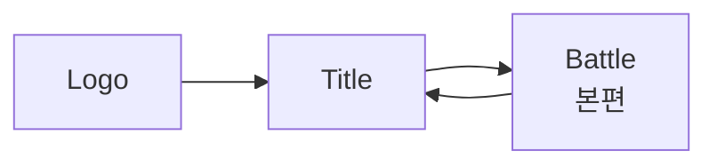
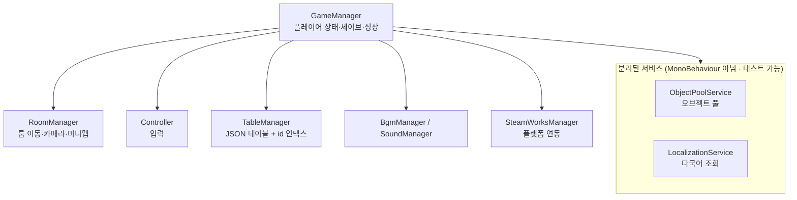

# Damn Adventure (망할 모험)

> 3인의 캐릭터를 **전투 중 실시간으로 교체**하며 싸우는 2D 액션 메트로배니아.
> Unity 6 / C# 기반, 개인 개발 프로젝트입니다.

---

## 목차

- [한눈에 보기](#한눈에-보기)
- [게임 소개](#게임-소개)
- [핵심 구현 하이라이트](#핵심-구현-하이라이트)
- [기술 스택](#기술-스택)
- [프로젝트 구조](#프로젝트-구조)
- [직접 만든 에디터 툴](#직접-만든-에디터-툴)
- [이 저장소에 대하여](#이-저장소에-대하여)
- [플레이 정보](#플레이-정보)
- [더 읽을 문서](#더-읽을-문서)

---

## 한눈에 보기

| 항목 | 내용 |
|---|---|
| **장르** | 2D 액션 메트로배니아 (횡스크롤) |
| **엔진** | Unity `6000.3.10f1` / C# |
| **개발 기간** | 2025.04 ~ 진행 중 (16개월 이상, 커밋 257회) |
| **개발 인원** | 1인 (기획·프로그래밍·연출) |
| **코드 규모** | C# 스크립트 234개 / 약 42,900줄 (에디터 툴 6개 · EditMode 테스트 67개 포함) |
| **컨텐츠 규모** | 룸 59개 · 몬스터 21종 · 플레이어블 3종 |
| **지원 언어** | 8개 (한/영/일/중간체/중번체/스페인/러시아/포르투갈) |
| **플랫폼** | PC (Steam / Steamworks.NET 연동) |

---

## 게임 소개

### 캐릭터 교체가 곧 전투 시스템

이 게임의 중심 메커닉은 **광전사 / 총잡이 / 싸움꾼 3인의 실시간 교체**입니다.
세 캐릭터는 각자 별도의 HP·스킬·쿨타임을 가지며, `Shift` 키로 즉시 교체됩니다.

교체는 단순한 캐릭터 변경이 아니라 **공격 수단**입니다.
각 캐릭터는 `ChangeAttack`(교체 등장 공격)을 가지고 있어, 교체 타이밍 자체가 콤보의 일부가 됩니다.

| 캐릭터 | 콘셉트 | 대표 스킬 |
|---|---|---|
| **광전사 (Berserker)** | 대검 · 저스트 카운터 | `UpperSlash` · `FireStrike` · `SwordCounter` · `Crash` · `ChargeCrash` |
| **총잡이 (Gunner)** | 원거리 사격 + 속성 부여 | `Grenade` · `KnockBackShot` · `CrazyShot` · `ElementalInfusion` · `BigShot` |
| **싸움꾼 (Fighter)** | 전기 속성 근접 연타 | `LightningKick` · `LightningPunch` · `LightningSmash` · `StrongPunch` |

교체 순서도 이 순서로 고정되어 있습니다 (`GameManager.PlayerRotation`).

### 스킬을 "고르는" 게 아니라 "키우는" 성장

스킬 자체보다 **스킬 특성(Attribute) 트리**가 성장의 축입니다.
하나의 스킬에 여러 특성이 달려 있고, 각 특성은 **코스트**를 소모해 해금됩니다.

```
Berserker_UpperSlash
├─ SwordBeam    (cost 2)  시전속도 +70%
├─ SwiftSlash   (cost 3)  돌진베기 추가 + 슈퍼아머 부여
└─ ...
```

특성은 수치 강화에 그치지 않고 **스킬의 동작 자체를 바꿉니다**.
방어 타입(`SuperArmor`)을 부여하거나, 투사체를 추가 생성하거나, 디버프를 얹는 식입니다.
이 모든 분기는 코드가 아니라 `SkillAttribute.json` 한 곳에서 정의됩니다.

---

## 핵심 구현 하이라이트

> 아래는 요약입니다. **왜 그렇게 만들었는지**에 대한 상세한 설명은
> [`docs/TECH-NOTES.md`](docs/TECH-NOTES.md) 에 사례별로 정리해 두었습니다.

### 1. 7단계 방어 타입으로 만든 액션 타격감

액션 게임의 손맛은 "누가 맞고 누가 밀리는가"의 규칙에서 나옵니다.
이를 위해 캐릭터의 방어 상태를 **7단계**로 세분화했습니다.

```csharp
public enum EBodyType
{
    Normal,       // 모든 타격에 경직
    SuperArmor,   // 경직 무시, 상태이상으로 파괴됨
    HeavyArmor,   // 경직 무시, 상태이상은 걸리나, 공중에 뜨지 않음
    StrongArmor,  // 보스 전용, 무력화 게이지를 다 깎으면 그로기 시간동안 Normal판정으로 변함
    HyperArmor,   // 보스 전용, 무력화 게이지를 다 깎으면 그로기, 대신 공중에 뜨지 않음
    UnChange,     // 보스 전용, 모든 경직 및 에어본 무시
    Counter,      // 피격 시 반격으로 전환
}
```

특히 `Counter`는 **저스트 프레임(0.15초) 판정**을 가집니다.
광전사의 `SwordCounter`는 가드 자세 진입 후 정확한 타이밍에 피격당했을 때만
반격으로 전환되며, 그 외에는 일반 가드로 처리됩니다.

→ [상세: 왜 방어 타입을 7단계까지 나눴는가](docs/TECH-NOTES.md#1-방어-타입을-7단계까지-나눈-이유)

### 2. 우선순위 기반 실드 소비 로직

여러 실드가 동시에 걸릴 수 있는 구조에서 **"무엇부터 깎을 것인가"** 가 문제가 됩니다.
스킬 실드와 유물 실드가 겹칠 때 플레이어가 손해 보지 않도록,
소비 순서를 명시적으로 정렬합니다.

```csharp
shieldList.Sort((a, b) =>
{
    int p = a.priority.CompareTo(b.priority);
    if (p != 0) return p;

    // 무한(duration <= 0) 실드는 가장 나중에 소비
    float at = a.duration > 0 ? a.currentTime : float.MaxValue;
    float bt = b.duration > 0 ? b.currentTime : float.MaxValue;
    return at.CompareTo(bt);
});
```

**우선순위 → 잔여시간 짧은 순 → 무한 실드 순**으로 소모됩니다.
곧 사라질 실드를 먼저 쓰게 해서 낭비를 막는 설계입니다.

→ [상세: 실드가 겹칠 때 생긴 문제](docs/TECH-NOTES.md#2-실드가-겹칠-때-무엇부터-깎을-것인가)

### 3. 틱 기반 버프/디버프 시스템

지속 피해(화상)와 즉시 효과(빙결)를 하나의 구조로 다루기 위해
버프에 **틱 간격**과 **다음 틱 시각**을 두었습니다.

```csharp
public class Buff
{
    public float tickInterval;  // 틱 간격
    public float nextTickTime;  // 다음 틱 대기시간
    public Action tickAction;   // 틱마다 실행할 연출/피해
    public Action endAction;    // 만료 시 콜백
}
```

`EBuffType` 13종(기절·경직·방깨·빙결·감전·화상·공속·이속·실드·공격력·3속성)이
모두 이 한 구조 위에서 동작합니다.

### 4. 데이터 주도 설계 — 밸런스는 코드를 건드리지 않는다

전투 수치, 몬스터 AI 패턴, 스킬 분기, 대사, 룸 연결이 **전부 JSON 테이블**에 있습니다.
`TableManager`가 이를 일괄 로드하며, 밸런스 조정에 재컴파일이 필요 없습니다.

| 테이블 | 역할 | 크기 |
|---|---|---|
| `SpawnedObject.json` | 생성 오브젝트 정의 | 209 KB |
| `Attack.json` | 공격 판정 프레임 데이터 | 118 KB |
| `Monster.json` | 몬스터 스탯 · AI 패턴 | 49 KB |
| `SkillAttribute.json` | 스킬 특성 트리 | 23 KB |
| `Rooms.json` | 룸 연결 · 레이아웃 | 22 KB |
| `Talk.json` | 8개 언어 텍스트 | — |

총 **20종**의 테이블로 구성되어 있습니다.

#### 데이터로 옮기지 않은 것 — 스토리 연출

같은 원칙을 연출에는 적용하지 않았습니다. 스토리 연출 14종은 C#에 그대로 있습니다.
일관성이 없어 보이는 부분이라 기준을 밝혀 둡니다.

데이터화의 이득은 **변경 빈도**에서 나옵니다. 밸런스 수치는 출시까지 수십 번 바뀌므로
재빌드 비용이 크지만, 연출은 한 번 만들면 거의 고치지 않습니다.

옮겼을 때 실제로 얼마나 줄어드는지 먼저 재봤습니다.

| | 값 |
|---|---|
| 연출 14종 합계 | 1,036줄 |
| 대사 출력 쌍 | 69개 |
| 그런데 **연속 구간** | **50개** (평균 1.4개, 최대 3개) |
| 대사를 목록으로 묶었을 때 감소 | **86줄 (8%)** |

대사 사이사이에 딜레이·캐릭터 이동·카메라·조건 분기가 끼어 있어서
**압축할 중복 자체가 없었습니다.** 연출은 재사용되는 로직이 아니라 일회성 안무입니다.

명령 해석기를 만들면 명령 20~30종을 정의해야 하고, 그 대가로 타입 검사와 디버거를 잃습니다.
그래서 데이터화 대신 **파일 분리**(`Room.Product.cs`)로만 정리했습니다.

> 대신 연출 **트리거**는 데이터/씬 쪽에 있습니다.
> `ProductTrigger` 컴포넌트를 룸 프리팹에 배치하면 `Room` 이 수집해 연결하고,
> 이미 본 연출은 세이브를 보고 트리거째로 비활성화됩니다.

### 5. 8개 언어 로컬라이징

모든 표시 텍스트는 하드코딩 대신 `idx` 참조로 관리됩니다.

```json
{
  "idx": 10000,
  "kr": "망할 모험",  "en": "Damn Adventure",
  "ja": "クソったれな冒険", "cn": "该死的冒险",
  "tw": "該死的冒險",  "es": "Una Maldita Aventura",
  "ru": "Чёртово приключение", "pt": "Uma Maldita Aventura"
}
```

스킬 설명(`explainTalk`), NPC 대사, UI 라벨이 모두 같은 경로를 탑니다.
언어 추가 시 **컬럼 하나만 늘리면** 됩니다.

### 6. 리소스 로딩과 메모리 관리

- **에디터에서 참조를 미리 수집해 씬에 직렬화**합니다. `PrefabCacher` / `SoundCacher` 가
  `AssetDatabase` 로 프리팹과 오디오 클립을 훑어 목록을 채워두고, 런타임은 그 목록만 씁니다.
  런타임에 경로 문자열로 에셋을 찾는 경로가 없어, **에셋을 옮기거나 이름을 바꾸면
  실행 중이 아니라 캐싱 시점에 드러납니다.**
- **SpriteAtlas 2종**(UI / 배경)을 초기화 시 한 번에 펼쳐 캐싱합니다.
- **JSON 테이블은 `Resources.Load`** 로 한 번에 읽고 id 인덱스를 만듭니다 (`TableManager`).
- **오브젝트 풀 5종** — 월드 오브젝트 / UI 오브젝트 / HUD / 팝업 / 최상위를 분리 운영합니다.
  uGUI는 형제 순서가 곧 렌더 순서라, 부모를 나누면 **계층 정리와 레이어 관리를 동시에** 얻습니다.
- **`GameObject.Find` 계열 호출을 전 코드베이스에서 2회로 억제**했습니다.
  문자열 탐색은 비용도 크지만, **이름을 바꾸면 컴파일 에러 없이 조용히 깨지는** 쪽이 더 문제입니다.

풀링에서 실제로 어려웠던 것은 성능이 아니라 **재사용 시 이전 상태를 물려받는 문제**였습니다.
파티클 잔상, 이전 소유자의 콜백이 남는 버그를 겪고 나서 초기화 규칙을 테스트로 고정했습니다.

→ [상세: 부활 후 미사일 — 재현이 안 되던 고질적 버그](docs/TECH-NOTES.md#4-부활-후-미사일--재현이-안-되던-고질적-버그)

### 7. UniTask 기반 비동기 연출

스킬 연출, 룸 전환, 컷신, 페이드가 모두 코루틴이 아닌 **UniTask**로 작성되어 있습니다.

- UniTask 사용 파일 **58개**
- `CancellationToken` 전파 파일 **46개**

캐릭터가 파괴되거나 씬이 전환될 때 진행 중이던 연출이 남지 않도록
취소 토큰을 함께 넘깁니다.

```csharp
private async UniTask<bool> SwordCounter()
{
    float justTime = 0.15f;   // 저스트 카운터 판정 창
    StateSetting(ENormalState.Skill, ...);
    BodyTypeSetting(EBodyType.Counter);
    // ...
}
```

---

## 기술 스택

| 분류 | 사용 기술 |
|---|---|
| **엔진 / 언어** | Unity 6000.3.10f1, C# |
| **비동기** | UniTask (`Cysharp.Threading.Tasks`) |
| **에셋 관리** | SpriteAtlas, 에디터 캐싱(`PrefabCacher` / `SoundCacher`) |
| **연출 / 트윈** | DOTween, Cinemachine |
| **UI** | uGUI, TextMeshPro |
| **플랫폼 SDK** | Steamworks.NET |
| **데이터** | JSON + `JsonUtility` (`[Serializable]` 데이터 클래스) |

---

## 프로젝트 구조

### 씬 흐름



### 매니저 계층

모든 코어 매니저는 `DontDestroyOnLoad`로 씬 간 유지됩니다.



`GameManager` 는 역할별 `partial` 파일로 나뉘어 있습니다.

```
GameManager.cs              403줄   필드 · 초기화 · 시간/입력 위임
GameManager.Progression.cs 1172줄   스킬 · 특성 · 유물
GameManager.Save.cs         413줄   세이브 · 로드
GameManager.Player.cs       303줄   캐릭터 교체
GameManager.Npc.cs          279줄   대화 · 퀘스트
GameManager.Ui.cs           231줄   UI 스폰 · 갱신
GameManager.Pool.cs         182줄   풀 서비스 위임
GameManager.World.cs        152줄   몬스터 · 카메라 · 딜레이
GameManager.Text.cs          32줄   다국어 서비스 위임
```

> `partial` 은 파일만 가를 뿐 **결합을 줄이지 않습니다.** 위 9개는 여전히 한 클래스입니다.
> 실제로 뽑아낸 것은 아래 서비스들이고, 무엇을 뽑을지는 필드 의존도로 판정했습니다.

| 서비스 | 책임 | 테스트 |
|---|---|---:|
| `LocalizationService` | 다국어 텍스트 조회 | 10개 |
| `ObjectPoolService` | 오브젝트 풀 | 13개 |
| `GameFlowService` | 시간 정지 · 입력 잠금 · 슬로우모션 | 10개 |
| `TableParse` | 테이블 파싱 (로케일 고정) | 10개 |
| `RoomMinimap` | 미니맵 공개 상태 | 7개 |
| `MinimapCellCodec` | 미니맵 세이브 형식 | 9개 |

### 캐릭터 상속 구조

```
Character (상태 머신 · 버프/실드 · HP/MP · 방어 타입)
├── Player  ──► Player_Berserker / Player_Gunner / Player_Fighter
├── Monster ──► Monster_Bat, Monster_Bull, Monster_FireWizard, … (21종)
└── Npc     ──► Npc_Merchant, Npc_Fighter, Npc_Gunner, Npc_GameSystem, …
```

`Character` 기반 클래스가 담당하는 것:

- 상태 머신 `ENormalState` **21종** (Idle / Move / Jump / Attack / Skill / Stun / Frozen / Airborne / Die …)
- 이동 상태 `EMoveState`, 접지 상태 `ELandingState`
- 방어 타입 `EBodyType` **7종**
- 버프·디버프 `EBuffType` **13종**, 실드 리스트

### 전투 판정

- `Attack` 컴포넌트가 `OnTriggerEnter2D` + `AttackInfo` 데이터로 판정
  - 데미지 계수 / 치명타 / 넉백 / 상태이상 / 방어무시 / 다단히트
- 투사체: `Missile` · `Grenade` · `LaserBeam` (`IProjectile` 인터페이스)

### 룸 구성

- `Room` — 방 상태, 몬스터 스폰, NPC 배치, 보물상자, 지름길, 카메라 경계, 미니맵 마커
- `Room.Product.cs` / `Room.InfoSetting.cs` — 연출과 세이브 복원 (`partial`)
- `RoomMinimap` / `MinimapCellCodec` — 미니맵 공개 상태와 저장 형식
- `RoomManager` — 룸 간 비동기 페이드 전환, 카메라 인계, 게임오버 흐름
- `TotalRoom` — 전체 룸 컨테이너
- `Arena` — 라운드 기반 전투 구역 (`Arena.json`)

> 에피소드 연출을 담당하던 `Stage` 계열 클래스는 **2챕터 컨셉 변경으로 제거**했습니다.
> 연출 흐름은 재설계 중입니다.

### UI 아키텍처 (MVP)

UI는 **View 인터페이스 / Model / Presenter**로 분리되어 있습니다.
현재 `IPopup*View`·`IUI*View` 계열 인터페이스 **33개**가 정의되어 있습니다.

```csharp
public interface IPopupCommonView          // View 계약
{
    void SetTitle(string title);
    void SetDesc(string desc);
    void SetButton(UIButtonData data);
    void SetClose(Action onClose);
}

public class PopupCommonModel { … }        // 데이터

public class PopupCommonPresenter          // 로직 (MonoBehaviour 아님)
{
    public PopupCommonPresenter(IPopupCommonView view, PopupCommonModel model) { … }
}

public class PopupCommonView : UIBase, IPopupCommonView   // uGUI 구현
{
    private PopupCommonPresenter presenter;

    // View 가 자기 Presenter 를 조립한다
    public PopupCommonPresenter Bind(PopupCommonModel model)
    {
        presenter = new PopupCommonPresenter(this, model);
        return presenter;
    }
}
```

**조립 책임을 View가 갖습니다.** 호출부는 한 줄입니다.

```csharp
popupStore.StoreView.Bind(storeModel).SetAction();
```

---

## 직접 만든 에디터 툴

작업량이 늘어나면서 반복 작업을 툴로 옮겼습니다. 총 6개 / 약 760줄입니다.

| 툴 | 해결한 문제 |
|---|---|
| **`RoomAssemblerWindow`** | 룸을 손으로 배치하는 비용이 감당 안 됨 → **JSON 룸 데이터를 읽어 타일맵(Ground/Platform/Trap/Laser)과 몬스터·프롭 마커를 자동 조립** |
| **`SpriteAtlasGeneratorTool`** | 아틀라스를 수작업으로 묶는 실수 방지 → 규칙 기반 자동 생성 |
| **`SpriteAtlasUncompressTool`** | 압축 아틀라스 디버깅 곤란 → 일괄 해제 |
| **`SyncPrefabInstanceNames`** | 프리팹 인스턴스 이름이 원본과 어긋나 참조가 깨짐 → 일괄 동기화 |
| **`MoveSelectedObjectsWindow`** | 다수 오브젝트 정밀 이동 |
| **`ScreenshotCaptureTool`** | `F5` 단축키로 스크린샷 캡처 (데모 빌드에서는 자동 차단) |

`RoomAssemblerWindow`가 읽는 데이터 형식:

```jsonc
{
  "roomId": "A3",
  "cellSize":   { "x": 1.28, "y": 1.28 },
  "gridOrigin": { "x": 0,    "y": 0    },

  "ground":    [ { "grid": { "x": 0, "y": 0 } } ],
  "platforms": [ … ],
  "traps":     [ … ],
  "lasers":    [ … ],
  "transforms":[ { "name": "Monster_Bat", "grid": { "x": 12, "y": 4 } } ]
}
```

---

## 이 저장소에 대하여

> 📌 **코드 열람용 저장소입니다.**
> 실행 가능한 Unity 프로젝트가 아니라, **직접 작성한 C# 코드만** 담고 있습니다.

### 담긴 것

> 📌 **전체 코드가 아니라, 문서에서 설명한 부분의 대표 코드만 발췌했습니다.**
> 전체 규모는 **C# 스크립트 234개 / 약 42,900줄**이고, 이 저장소에는 그중 **128개**가 있습니다.
> 같은 패턴이 반복되는 부분(몬스터 21종, 팝업 30종 등)은 **대표 사례만** 담았습니다.
> 예를 들어 `Monster` 기반 클래스와 변형 5종이 있으면 상속 구조를 판단하기에 충분하다고 보았습니다.

```
Assets/Scripts/     게임 로직 114개 (발췌)
Assets/Editor/      직접 만든 에디터 툴 6개 (전부)
Assets/Tests/       EditMode 테스트 67개 (전부)
docs/               설계 문서 · 기술 노트 · UI 목업
```

문서에서 근거로 든 코드는 전부 담았습니다.
`RoomMinimap` · `MinimapCellCodec` · `GameFlowService` · `TableParse` ·
`LocalizationService` · `ObjectPoolService` 와 각각의 테스트가 여기 있습니다.

폴더 구조는 실제 프로젝트와 동일하게 유지했습니다.

### 담기지 않은 것과 그 이유

| 제외 대상 | 이유 |
|---|---|
| 아트 · 사운드 · VFX 리소스 | **유니티 에셋스토어 유료 에셋**이 포함되어 있어, EULA상 원본 재배포가 불가합니다 |
| 씬 · 프리팹 · 프로젝트 설정 | 위 리소스에 의존하므로 단독으로는 의미가 없습니다 |
| `.meta` 파일 | 코드 열람에 불필요해 제외했습니다 |
| 서드파티 코드 | `Steamworks.NET` 등 직접 작성하지 않은 코드는 제외했습니다 |

**따라서 이 저장소의 모든 `.cs` 파일은 직접 작성한 코드입니다.**

### 개발 환경

- Unity **6000.3.10f1** / C#
- Windows (Steamworks.NET 연동 기준)

---

## 플레이 정보

### 세이브 데이터 위치

```
%USERPROFILE%\AppData\LocalLow\HansanGame\Damn Adventure Demo\Save\
```

---

## 더 읽을 문서

### 기술 문서

| 문서 | 내용 |
|---|---|
| [`docs/ARCHITECTURE.md`](docs/ARCHITECTURE.md) | 시스템별 설계 상세 — 상태 머신, 전투 판정, 데이터 로딩, UI 계층, 룸 전환 |
| [`docs/ARCHITECTURE.md#14`](docs/ARCHITECTURE.md#14-적용한-설계-패턴) | **적용한 설계 패턴** — Template Method · Singleton · Facade · Object Pool · MVP |

---

## 라이선스 / 저작권

본 저장소는 **포트폴리오 열람 목적**으로 공개되어 있습니다.
코드 외의 아트·사운드 리소스 중 일부는 상용 에셋으로, 별도 라이선스를 따릅니다.
