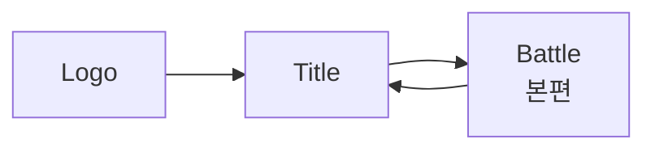
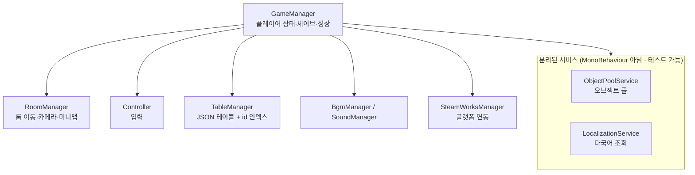

# Damn Adventure (망할 모험)

> 3인의 캐릭터를 **전투 중 실시간으로 교체**하며 싸우는 2D 액션 메트로배니아.
> Unity 6 / C# 기반, 개인 개발 프로젝트입니다.

---

## 목차

- [한눈에 보기](#한눈에-보기)
- [게임 소개](#게임-소개)
- [핵심 구현 하이라이트](#핵심-구현-하이라이트)
- [기술 스택](#기술-스택)
- [프로젝트 구조](#프로젝트-구조)
- [적용한 설계 패턴](#적용한-설계-패턴)
- [직접 만든 에디터 툴](#직접-만든-에디터-툴)
- [이 저장소에 대하여](#이-저장소에-대하여)
- [플레이 정보](#플레이-정보)

---

## 한눈에 보기

| 항목 | 내용 |
|---|---|
| **장르** | 2D 액션 메트로배니아 (횡스크롤) |
| **엔진** | Unity `6000.3.10f1` / C# |
| **개발 인원** | 1인 (기획·프로그래밍·연출) |
| **코드 규모** | C# 스크립트 227개 / 약 41,400줄 (에디터 툴 6개 · EditMode 테스트 49개 포함) |
| **컨텐츠 규모** | 룸 59개 · 몬스터 21종 · 플레이어블 3종 |
| **지원 언어** | 8개 (한/영/일/중간체/중번체/스페인/러시아/포르투갈) |
| **플랫폼** | PC (Steam / Steamworks.NET 연동) |

---

## 게임 소개

### 캐릭터 교체가 곧 전투 시스템

이 게임의 중심 메커닉은 **광전사 / 총잡이 / 싸움꾼 3인의 실시간 교체**입니다.
세 캐릭터는 각자 별도의 HP·스킬·쿨타임을 가지며, `Shift` 키로 즉시 교체됩니다.

교체는 단순한 캐릭터 변경이 아니라 **공격 수단**입니다.
각 캐릭터는 `ChangeAttack`(교체 등장 공격)을 가지고 있어, 교체 타이밍 자체가 콤보의 일부가 됩니다.

| 캐릭터 | 콘셉트 | 대표 스킬 |
|---|---|---|
| **광전사 (Berserker)** | 대검 · 저스트 카운터 | `UpperSlash` · `FireStrike` · `SwordCounter` · `Crash` · `ChargeCrash` |
| **총잡이 (Gunner)** | 원거리 사격 + 속성 부여 | `Grenade` · `KnockBackShot` · `CrazyShot` · `ElementalInfusion` · `BigShot` |
| **싸움꾼 (Fighter)** | 전기 속성 근접 연타 | `LightningKick` · `LightningPunch` · `LightningSmash` · `StrongPunch` |

교체 순서도 이 순서로 고정되어 있습니다 (`GameManager.PlayerRotation`).

### 스킬을 "고르는" 게 아니라 "키우는" 성장

스킬 자체보다 **스킬 특성(Attribute) 트리**가 성장의 축입니다.
하나의 스킬에 여러 특성이 달려 있고, 각 특성은 **코스트**를 소모해 해금됩니다.

```
Berserker_UpperSlash
├─ SwordBeam    (cost 2)  시전속도 +70%
├─ SwiftSlash   (cost 3)  돌진베기 추가 + 슈퍼아머 부여
└─ ...
```

특성은 수치 강화에 그치지 않고 **스킬의 동작 자체를 바꿉니다**.
방어 타입(`SuperArmor`)을 부여하거나, 투사체를 추가 생성하거나, 디버프를 얹는 식입니다.
이 모든 분기는 코드가 아니라 `SkillAttribute.json` 한 곳에서 정의됩니다.

---

## 핵심 구현 하이라이트

### 1. 7단계 방어 타입으로 만든 액션 타격감

액션 게임의 손맛은 "누가 맞고 누가 밀리는가"의 규칙에서 나옵니다.
이를 위해 캐릭터의 방어 상태를 **7단계**로 세분화했습니다.

```csharp
public enum EBodyType
{
    Normal,       // 모든 타격에 경직
    SuperArmor,   // 경직 무시, 상태이상으로 파괴됨
    HeavyArmor,   // 경직 무시, 상태이상은 걸리나, 공중에 뜨지 않음
    StrongArmor,  // 보스 전용, 무력화 게이지를 다 깎으면 그로기 시간동안 Normal판정으로 변함
    HyperArmor,   // 보스 전용, 무력화 게이지를 다 깎으면 그로기, 대신 공중에 뜨지 않음
    UnChange,     // 보스 전용, 모든 경직 및 에어본 무시
    Counter,      // 피격 시 반격으로 전환
}
```

특히 `Counter`는 **저스트 프레임(0.15초) 판정**을 가집니다.
광전사의 `SwordCounter`는 가드 자세 진입 후 정확한 타이밍에 피격당했을 때만
반격으로 전환되며, 그 외에는 일반 가드로 처리됩니다.

### 2. 우선순위 기반 실드 소비 로직

여러 실드가 동시에 걸릴 수 있는 구조에서 **"무엇부터 깎을 것인가"** 가 문제가 됩니다.
스킬 실드와 유물 실드가 겹칠 때 플레이어가 손해 보지 않도록,
소비 순서를 명시적으로 정렬합니다.

```csharp
shieldList.Sort((a, b) =>
{
    int p = a.priority.CompareTo(b.priority);
    if (p != 0) return p;

    // 무한(duration <= 0) 실드는 가장 나중에 소비
    float at = a.duration > 0 ? a.currentTime : float.MaxValue;
    float bt = b.duration > 0 ? b.currentTime : float.MaxValue;
    return at.CompareTo(bt);
});
```

**우선순위 → 잔여시간 짧은 순 → 무한 실드 순**으로 소모됩니다.
곧 사라질 실드를 먼저 쓰게 해서 낭비를 막는 설계입니다.

### 3. 틱 기반 버프/디버프 시스템

지속 피해(화상)와 즉시 효과(빙결)를 하나의 구조로 다루기 위해
버프에 **틱 간격**과 **다음 틱 시각**을 두었습니다.

```csharp
public class Buff
{
    public float tickInterval;  // 틱 간격
    public float nextTickTime;  // 다음 틱 대기시간
    public Action tickAction;   // 틱마다 실행할 연출/피해
    public Action endAction;    // 만료 시 콜백
}
```

`EBuffType` 13종(기절·경직·방깨·빙결·감전·화상·공속·이속·실드·공격력·3속성)이
모두 이 한 구조 위에서 동작합니다.

### 4. 데이터 주도 설계 — 밸런스는 코드를 건드리지 않는다

전투 수치, 몬스터 AI 패턴, 스킬 분기, 대사, 룸 연결이 **전부 JSON 테이블**에 있습니다.
`TableManager`가 이를 일괄 로드하며, 밸런스 조정에 재컴파일이 필요 없습니다.

| 테이블 | 역할 | 크기 |
|---|---|---|
| `SpawnedObject.json` | 생성 오브젝트 정의 | 209 KB |
| `Attack.json` | 공격 판정 프레임 데이터 | 118 KB |
| `Monster.json` | 몬스터 스탯 · AI 패턴 | 49 KB |
| `SkillAttribute.json` | 스킬 특성 트리 | 23 KB |
| `Rooms.json` | 룸 연결 · 레이아웃 | 22 KB |
| `Talk.json` | 8개 언어 텍스트 | — |

총 **20종**의 테이블로 구성되어 있습니다.

#### 데이터로 옮기지 않은 것 — 스토리 연출

같은 원칙을 연출에는 적용하지 않았습니다. 스토리 연출 14종은 C#에 그대로 있습니다.
일관성이 없어 보이는 부분이라 기준을 밝혀 둡니다.

데이터화의 이득은 **변경 빈도**에서 나옵니다. 밸런스 수치는 출시까지 수십 번 바뀌므로
재빌드 비용이 크지만, 연출은 한 번 만들면 거의 고치지 않습니다.

옮겼을 때 실제로 얼마나 줄어드는지 먼저 재봤습니다.

| | 값 |
|---|---|
| 연출 14종 합계 | 1,036줄 |
| 대사 출력 쌍 | 69개 |
| 그런데 **연속 구간** | **50개** (평균 1.4개, 최대 3개) |
| 대사를 목록으로 묶었을 때 감소 | **86줄 (8%)** |

대사 사이사이에 딜레이·캐릭터 이동·카메라·조건 분기가 끼어 있어서
**압축할 중복 자체가 없었습니다.** 연출은 재사용되는 로직이 아니라 일회성 안무입니다.

명령 해석기를 만들면 명령 20~30종을 정의해야 하고, 그 대가로 타입 검사와 디버거를 잃습니다.
그래서 데이터화 대신 **파일 분리**(`Room.Product.cs`)로만 정리했습니다.

> 대신 연출 **트리거**는 데이터/씬 쪽에 있습니다.
> `ProductTrigger` 컴포넌트를 룸 프리팹에 배치하면 `Room` 이 수집해 연결하고,
> 이미 본 연출은 세이브를 보고 트리거째로 비활성화됩니다.

### 5. 8개 언어 로컬라이징

모든 표시 텍스트는 하드코딩 대신 `idx` 참조로 관리됩니다.

```json
{
  "idx": 10000,
  "kr": "망할 모험",  "en": "Damn Adventure",
  "ja": "クソったれな冒険", "cn": "该死的冒险",
  "tw": "該死的冒險",  "es": "Una Maldita Aventura",
  "ru": "Чёртово приключение", "pt": "Uma Maldita Aventura"
}
```

스킬 설명(`explainTalk`), NPC 대사, UI 라벨이 모두 같은 경로를 탑니다.
언어 추가 시 **컬럼 하나만 늘리면** 됩니다.

### 6. 리소스 로딩과 메모리 관리

**에셋 참조를 에디터에서 확정합니다.** 런타임에 경로 문자열로 에셋을 찾는 경로가 없습니다.
에디터 툴이 미리 참조를 수집해 씬에 직렬화해 두고, 런타임은 그 목록만 사용합니다.

```csharp
// PrefabCacher — 인스펙터 우클릭 "Cache Prefabs"
string[] guids = AssetDatabase.FindAssets("t:Prefab", new[] { ConstValues.PrefabFolder });
foreach (var guid in guids)
{
    var prefab = AssetDatabase.LoadAssetAtPath<GameObject>(AssetDatabase.GUIDToAssetPath(guid));
    if (prefab != null)
        GameManager.Instance.GetPrefabList().Add(prefab);
}
```

수집된 목록은 `GameManager.prefabList` 로 직렬화되어 초기화 때 `ObjectPoolService` 에 넘어갑니다.
오디오도 `SoundCacher` 가 같은 방식으로 처리합니다.

**이 방식의 이점은 실패 시점입니다.** 경로 문자열 로딩은 에셋을 옮기거나 이름을 바꿔도
컴파일 에러가 나지 않고, 해당 오브젝트를 생성하는 순간에야 조용히 깨집니다.
참조를 미리 확정해 두면 캐싱 시점에 드러나고, 그때는 아직 에디터 안입니다.
대신 에셋을 추가하면 캐싱을 다시 돌려야 합니다.

> 초기에는 Addressables 를 사용했지만 걷어냈습니다.
> 그룹·번들 설정을 유지하는 비용에 비해 단일 PC 빌드에서 얻는 것이 없었습니다.

**스프라이트 아틀라스**는 매번 `GetSprite(name)` 을 부르면 내부 탐색 비용이 발생하므로,
초기화 시 한 번에 펼쳐 딕셔너리에 담습니다. 조회는 O(1) 입니다.

```csharp
private void InitAtlas(SpriteAtlas spriteAtlas)
{
    cloneSprites = new Sprite[spriteAtlas.spriteCount];
    spriteAtlas.GetSprites(cloneSprites);          // 한 번에 채워진다

    foreach (var sprite in cloneSprites)
    {
        // "Icon_Sword(Clone)" → "Icon_Sword"
        var keyName = sprite.name.Split(ConstValues.AtlasClone)[0];
        atlasDic.Add(keyName, sprite);
    }
}
```

**오브젝트 풀은 용도별로 5개 부모 Transform** 을 분리 운영합니다.

| 풀 | 용도 |
|---|---|
| `objectPool` | 몬스터 · 투사체 · 이펙트 등 월드 오브젝트 |
| `uiObjectPool` | 데미지 텍스트 등 월드 상의 UI 오브젝트 |
| `uiPool` | HUD 화면 |
| `popupPool` | 팝업 화면 |
| `highestPool` | 항상 최상단에 그려져야 하는 요소 |

uGUI는 형제 순서가 곧 렌더 순서이므로, 부모를 나누면 **계층 정리와 레이어 관리를 동시에** 얻습니다.

**JSON 테이블**은 `Resources.Load` 로 한 번에 읽고 id 인덱스를 만듭니다 (`TableManager`).

**`GameObject.Find` / `FindObjectOfType` 는 전체 코드베이스에서 2회**만 사용합니다.
나머지는 인스펙터 주입 또는 매니저 경유입니다. 문자열 탐색은 비용도 크지만,
**이름을 바꾸면 컴파일 에러 없이 조용히 깨지는** 쪽이 더 문제입니다.

### 7. UniTask 기반 비동기 연출

스킬 연출, 룸 전환, 컷신, 페이드가 모두 코루틴이 아닌 **UniTask**로 작성되어 있습니다.

- UniTask 사용 파일 **58개**
- `CancellationToken` 전파 파일 **46개**

캐릭터가 파괴되거나 씬이 전환될 때 진행 중이던 연출이 남지 않도록
취소 토큰을 함께 넘깁니다.

```csharp
private async UniTask<bool> SwordCounter()
{
    float justTime = 0.15f;   // 저스트 카운터 판정 창
    StateSetting(ENormalState.Skill, ...);
    BodyTypeSetting(EBodyType.Counter);
    // ...
}
```

---

## 기술 스택

| 분류 | 사용 기술 |
|---|---|
| **엔진 / 언어** | Unity 6000.3.10f1, C# |
| **비동기** | UniTask (`Cysharp.Threading.Tasks`) |
| **에셋 관리** | SpriteAtlas, 에디터 캐싱(`PrefabCacher` / `SoundCacher`) |
| **연출 / 트윈** | DOTween, Cinemachine |
| **UI** | uGUI, TextMeshPro |
| **플랫폼 SDK** | Steamworks.NET |
| **데이터** | JSON + `JsonUtility` (`[Serializable]` 데이터 클래스) |

---

## 프로젝트 구조

### 씬 흐름



### 매니저 계층

모든 코어 매니저는 `DontDestroyOnLoad`로 씬 간 유지됩니다.



`GameManager` 는 역할별 `partial` 파일로 나뉘어 있습니다.

```
GameManager.cs              403줄   필드 · 초기화 · 시간/입력 위임
GameManager.Progression.cs 1172줄   스킬 · 특성 · 유물
GameManager.Save.cs         413줄   세이브 · 로드
GameManager.Player.cs       303줄   캐릭터 교체
GameManager.Npc.cs          279줄   대화 · 퀘스트
GameManager.Ui.cs           231줄   UI 스폰 · 갱신
GameManager.Pool.cs         182줄   풀 서비스 위임
GameManager.World.cs        152줄   몬스터 · 카메라 · 딜레이
GameManager.Text.cs          32줄   다국어 서비스 위임
```

> `partial` 은 파일만 가를 뿐 **결합을 줄이지 않습니다.** 위 9개는 여전히 한 클래스입니다.
> 실제로 뽑아낸 것은 아래 서비스들이고, 무엇을 뽑을지는 필드 의존도로 판정했습니다.

| 서비스 | 책임 | 테스트 |
|---|---|---:|
| `LocalizationService` | 다국어 텍스트 조회 | 10개 |
| `ObjectPoolService` | 오브젝트 풀 | 13개 |
| `GameFlowService` | 시간 정지 · 입력 잠금 · 슬로우모션 | 10개 |
| `TableParse` | 테이블 파싱 (로케일 고정) | 10개 |
| `RoomMinimap` | 미니맵 공개 상태 | 7개 |
| `MinimapCellCodec` | 미니맵 세이브 형식 | 9개 |

### 캐릭터 상속 구조

```
Character (상태 머신 · 버프/실드 · HP/MP · 방어 타입)
├── Player  ──► Player_Berserker / Player_Gunner / Player_Fighter
├── Monster ──► Monster_Bat, Monster_Bull, Monster_FireWizard, … (21종)
└── Npc     ──► Npc_Merchant, Npc_Fighter, Npc_Gunner, Npc_GameSystem, …
```

`Character` 기반 클래스가 담당하는 것:

- 상태 머신 `ENormalState` **21종** (Idle / Move / Jump / Attack / Skill / Stun / Frozen / Airborne / Die …)
- 이동 상태 `EMoveState`, 접지 상태 `ELandingState`
- 방어 타입 `EBodyType` **7종**
- 버프·디버프 `EBuffType` **13종**, 실드 리스트

### 전투 판정

- `Attack` 컴포넌트가 `OnTriggerEnter2D` + `AttackInfo` 데이터로 판정
  - 데미지 계수 / 치명타 / 넉백 / 상태이상 / 방어무시 / 다단히트
- 투사체: `Missile` · `Grenade` · `LaserBeam` (`IProjectile` 인터페이스)

### 룸 구성

- `Room` — 방 상태, 몬스터 스폰, NPC 배치, 보물상자, 지름길, 카메라 경계, 미니맵 마커
- `Room.Product.cs` / `Room.InfoSetting.cs` — 연출과 세이브 복원 (`partial`)
- `RoomMinimap` / `MinimapCellCodec` — 미니맵 공개 상태와 저장 형식
- `RoomManager` — 룸 간 비동기 페이드 전환, 카메라 인계, 게임오버 흐름
- `TotalRoom` — 전체 룸 컨테이너
- `Arena` — 라운드 기반 전투 구역 (`Arena.json`)

> 에피소드 연출을 담당하던 `Stage` 계열 클래스는 **2챕터 컨셉 변경으로 제거**했습니다.
> 연출 흐름은 재설계 중입니다.

### UI 아키텍처

대부분의 화면은 `MonoBehaviour` 인 View 가 Model(값 묶음)을 받아 직접 그립니다.
**화면 상태를 계산해야 하는 두 곳에만** Presenter 를 두었습니다.

```
UI_Interface        HUD 컨테이너 — 각 View 참조를 보관
  └ UIGoodsView     받은 값을 그린다 (Presenter 없음)
  └ UISkillView ×6  ─┐
                     └ UISkillPresenter — 슬롯 여러 개를 한 모델로 조율

Popup_Character     팝업 컨테이너 — 상태 전환과 조립
  └ PopupSkillView      각자 자기 화면만 그린다 (Presenter 없음)
  └ PopupAttributeView
```

`Popup_*` 컨테이너가 열림/닫힘과 입력 게이팅을 맡고, `*View` 가 표시를 맡습니다.
적용 기준과 코드는 [적용한 설계 패턴](#적용한-설계-패턴)의 MVP 항목에 있습니다.


---

## 적용한 설계 패턴

패턴을 쓰기 위해 쓴 것이 아니라, 문제를 풀다 보니 자리 잡은 것들입니다.
실제로 코드에 적용된 것만 적었습니다.

### Template Method

가장 넓게 쓰인 패턴입니다. **골격은 부모가 정하고 세부는 자식이 채웁니다.**

```csharp
public abstract class Character : InteractionController
{
    // 공통: 상태 머신, 버프/실드, HP/MP, 방어 타입은 여기서 처리한다
    protected List<Buff> buffList;
    protected List<Shield> shieldList;
    protected EBodyType bodyType;

    public int ConsumeShield(int damage) { … }   // 모든 캐릭터가 공유

    // 자식이 반드시 구현해야 하는 부분
    protected abstract void StateSetting(ENormalState state, string trigger, string animId);
    protected abstract void StateCheck();
    protected abstract void StateRecovery();
}

public abstract class Player : Character
{
    public abstract void Skill(KeyCode skillKey);   // 직업마다 스킬 구성이 다르다
    public abstract void ChangeAttack();            // 교체 등장 공격도 직업마다 다르다
}
```

`Character` 하나에 구현한 버프·실드·상태이상 로직을
**플레이어 3종 + 몬스터 21종 + NPC 8종**이 그대로 씁니다.
몬스터를 추가할 때 다시 구현할 것이 없습니다. `virtual` 50개 / `override` 130개.

### Singleton

씬을 넘어 유지되어야 하는 매니저에 적용했습니다. **용도가 달라 두 가지를 만들었습니다.**

```csharp
// 씬에 미리 배치해 두는 매니저 — 배치된 것을 찾아 쓴다
public class Singleton<T> : MonoBehaviour where T : MonoBehaviour
{
    public static T Instance
    {
        get
        {
            if (instance == null)
                instance = (T)FindObjectOfType(typeof(T));
            return instance;
        }
    }
}

// 씬 배치가 필요 없는 매니저 — 없으면 만들어서 쓴다
public class SingletonMono<T> : MonoBehaviour where T : MonoBehaviour
{
    private static object _lock = new object();

    public static T Instance
    {
        get
        {
            lock (_lock)                                  // 스레드 세이프
            {
                if (null == instance)
                {
                    GameObject singleton = new GameObject();
                    instance = singleton.AddComponent<T>();
                    if (Application.isPlaying)
                        DontDestroyOnLoad(singleton);
                }
                return instance;
            }
        }
    }
}
```

13개 클래스가 상속받습니다.

> 이 패턴의 대가도 겪었습니다. 어디서든 접근 가능하다 보니
> `GameManager` 에 계속 기능이 붙어 3,840줄까지 커졌습니다.

### Facade

내부 구조를 바꾸면서 **호출부를 건드리지 않기 위해** 썼습니다.
`GetTalk` 은 코드베이스 293곳에서 호출됩니다. 이걸 전부 고치는 대신
`GameManager` 가 얇은 창구로 남았습니다.

```csharp
// GameManager.Text.cs — 실제 로직은 LocalizationService 에 있다
public string GetTalk(int idx)
    => localization.GetTalk(idx, language);

// GameManager.Pool.cs — 실제 로직은 ObjectPoolService 에 있다
public GameObject SpawnToObjectPool(string id, Vector3 pos)
    => pool.Spawn(id, objectPool, pos);
```

덕분에 다국어 조회를 선형 탐색에서 `Dictionary` 로,
오브젝트 풀을 이름 기반에서 id 기반으로 바꾸면서도 **호출부는 한 곳도 수정하지 않았습니다.**

---

아래 둘은 성격이 다릅니다. 객체 간 관계를 정리하는 패턴이 아니라,
**특정 문제 영역을 위해 정립된 구조**입니다.

### Object Pool

전투 중 이펙트·투사체가 초당 수십 개 생성됩니다.
매번 `Instantiate`/`Destroy` 하면 GC 부담이 프레임 튐으로 돌아옵니다.

```csharp
public class ObjectPoolService
{
    private readonly Dictionary<string, GameObject> prefabById;
    private readonly Dictionary<string, List<GameObject>> instancesById;

    public GameObject Spawn(string id, Transform parent, Vector3 position)
    {
        var go = GetRecyclable(id) ?? Create(id, parent);   // 재사용 우선, 없으면 생성
        if (!go)
            return null;                 // 프리팹이 없으면 경고 후 null (이전에는 크래시)

        go.transform.position = position;
        go.SetActive(true);
        ResetParticles(go);              // 재사용 시 이전 상태를 물려받지 않도록 초기화
        return go;
    }

    private GameObject GetRecyclable(string id)
    {
        if (!instancesById.TryGetValue(id, out var list))
            return null;

        for (int i = 0; i < list.Count; i++)
            if (list[i] && !list[i].activeSelf)
                return list[i];      // 같은 id 의 비활성 인스턴스를 앞에서부터
        return null;
    }
}
```

**이 패턴의 핵심은 `Instantiate` 를 줄이는 것이 아니라, 재사용 시 이전 상태를
물려받는 위험을 관리하는 것**입니다. 실제로 파티클 잔상이 남거나 미사일이
이전 소유자의 콜백을 물고 다니던 버그를 겪었고, 그래서 재사용 규칙을 테스트 13개로 고정했습니다.

### MVP (Model–View–Presenter)

**화면 상태를 계산해야 하는 곳에만 적용했습니다.** 표시만 하는 화면에는 두지 않습니다.

Presenter 를 둘 값어치는 "무엇을 그릴지 판단하는 부분"이 있을 때 생깁니다.
받은 값을 그대로 그리기만 한다면 전달 계층이 하나 늘어날 뿐입니다.

적용한 두 곳입니다.

| 대상 | 왜 필요한가 |
|---|---|
| `UISkillPresenter` | 스킬 슬롯 · 교체 · 물약 **View 여러 개를 한 모델로 조율**한다. View 하나가 자기 것만 봐서는 답이 안 나온다 |
| `PopupFastTravelPresenter` | 선택 인덱스와 입력 준비 여부 등 **화면 상태를 들고 있다** |

```csharp
// View 여러 개를 조율하는 쪽 — 이런 경우에만 Presenter 를 둔다
public class UISkillPresenter
{
    private readonly IUISkillView _changeView;
    private readonly IUISkillView _potionView;
    private readonly List<IUISkillView> _views;   // 스킬 슬롯들
    private UISkillModel _model;

    public void SetSkillInfo()
    {
        _changeView.SetSkillInfo(_model.changeSkill.keyCode, _model.changeSkill.skillId, …);

        for (int i = 0; i < _model.settingSkillList.Count; i++)
        {
            var playerSkill = _model.settingSkillList[i].playerSkill;
            if (playerSkill == null)                       // 아직 못 얻은 스킬
                _views[i].SetSkillInfo(_model.settingSkillList[i].keyCode, default);
            else
                _views[i].SetSkillInfo(…);
        }
    }
}
```

나머지 화면은 `MonoBehaviour` 인 View 가 Model 을 직접 받아 그립니다.

```csharp
// 판단할 것이 없는 화면 — Presenter 없이 View 가 직접 처리한다
public class UIGoodsView : MonoBehaviour
{
    [SerializeField] private TMP_Text goldText;

    public void SetGoldText(UIGoodsModel model) => SetGoldText(model.totalGold);

    private void SetGoldText(int gold)
        => goldText.text = GameManager.Instance.GetThousandCommaText(gold);
}
```

> 처음에는 UI 30종 전체에 Presenter 를 두었습니다.
> 다시 세어 보니 그중 **분기가 하나라도 있는 것은 2개뿐**이었고,
> 나머지 28개는 값을 그대로 넘기는 껍데기였습니다.
> 인터페이스 33개와 함께 정리해 **Presenter 2개 · 인터페이스 2개**가 남았습니다.


## 직접 만든 에디터 툴

작업량이 늘어나면서 반복 작업을 툴로 옮겼습니다. 총 6개 / 약 760줄입니다.

| 툴 | 해결한 문제 |
|---|---|
| **`RoomAssemblerWindow`** | 룸을 손으로 배치하는 비용이 감당 안 됨 → **JSON 룸 데이터를 읽어 타일맵(Ground/Platform/Trap/Laser)과 몬스터·프롭 마커를 자동 조립** |
| **`SpriteAtlasGeneratorTool`** | 아틀라스를 수작업으로 묶는 실수 방지 → 규칙 기반 자동 생성 |
| **`SpriteAtlasUncompressTool`** | 압축 아틀라스 디버깅 곤란 → 일괄 해제 |
| **`SyncPrefabInstanceNames`** | 프리팹 인스턴스 이름이 원본과 어긋나 참조가 깨짐 → 일괄 동기화 |
| **`MoveSelectedObjectsWindow`** | 다수 오브젝트 정밀 이동 |
| **`ScreenshotCaptureTool`** | `F5` 단축키로 스크린샷 캡처 (데모 빌드에서는 자동 차단) |

`RoomAssemblerWindow`가 읽는 데이터 형식:

```jsonc
{
  "roomId": "A3",
  "cellSize":   { "x": 1.28, "y": 1.28 },
  "gridOrigin": { "x": 0,    "y": 0    },

  "ground":    [ { "grid": { "x": 0, "y": 0 } } ],
  "platforms": [ … ],
  "traps":     [ … ],
  "lasers":    [ … ],
  "transforms":[ { "name": "Monster_Bat", "grid": { "x": 12, "y": 4 } } ]
}
```

---

## 이 저장소에 대하여

> 📌 **코드 열람용 저장소입니다.**
> 실행 가능한 Unity 프로젝트가 아니라, **직접 작성한 C# 코드만** 담고 있습니다.

### 담긴 것

> 📌 **전체 코드가 아니라, 문서에서 설명한 부분의 대표 코드만 발췌했습니다.**
> 전체 규모는 **C# 스크립트 227개 / 약 41,400줄**이고, 이 저장소에는 그중 **122개**가 있습니다.
> 같은 패턴이 반복되는 부분(몬스터 21종, 팝업 30종 등)은 **대표 사례만** 담았습니다.
> 예를 들어 `Monster` 기반 클래스와 변형 5종이 있으면 상속 구조를 판단하기에 충분하다고 보았습니다.

```
Assets/Scripts/     게임 로직 111개 (발췌)
Assets/Editor/      직접 만든 에디터 툴 6개 (전부)
Assets/Tests/       EditMode 테스트 49개 (전부)
```

이 README 에서 근거로 든 코드는 전부 담았습니다.
`RoomMinimap` · `MinimapCellCodec` · `GameFlowService` · `TableParse` ·
`LocalizationService` · `ObjectPoolService` 와 각각의 테스트가 여기 있습니다.

폴더 구조는 실제 프로젝트와 동일하게 유지했습니다.

### 담기지 않은 것과 그 이유

| 제외 대상 | 이유 |
|---|---|
| 아트 · 사운드 · VFX 리소스 | **유니티 에셋스토어 유료 에셋**이 포함되어 있어, EULA상 원본 재배포가 불가합니다 |
| 씬 · 프리팹 · 프로젝트 설정 | 위 리소스에 의존하므로 단독으로는 의미가 없습니다 |
| `.meta` 파일 | 코드 열람에 불필요해 제외했습니다 |
| 서드파티 코드 | `Steamworks.NET` 등 직접 작성하지 않은 코드는 제외했습니다 |

**따라서 이 저장소의 모든 `.cs` 파일은 직접 작성한 코드입니다.**

### 개발 환경

- Unity **6000.3.10f1** / C#
- Windows (Steamworks.NET 연동 기준)

---

## 플레이 정보

### 세이브 데이터 위치

```
%USERPROFILE%\AppData\LocalLow\HansanGame\Damn Adventure Demo\Save\
```

---

## 라이선스 / 저작권

본 저장소는 **포트폴리오 열람 목적**으로 공개되어 있습니다.
코드 외의 아트·사운드 리소스 중 일부는 상용 에셋으로, 별도 라이선스를 따릅니다.
