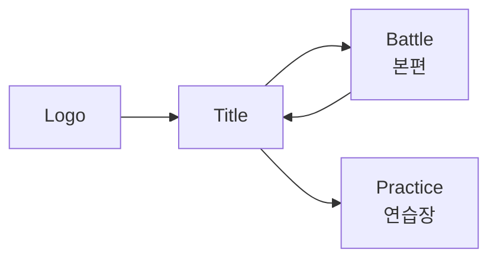
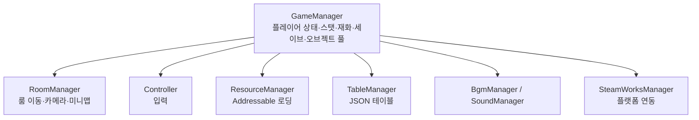

# Damn Adventure (망할 모험)

> 3인의 캐릭터를 **전투 중 실시간으로 교체**하며 싸우는 2D 액션 메트로배니아.
> Unity 6 / C# 기반, 개인 개발 프로젝트입니다.

<!--
  [스크린샷 자리 #1 — 대표 이미지]
  권장: 전투 중 스킬 이펙트가 크게 터지는 순간의 가로 스크린샷 1장.
  Unity 에디터에서 F5 (Tools/스크린샷 찍기)로 캡처 가능합니다.
  docs/images/hero.png 로 저장 후 아래 주석을 해제하세요.
-->
<!--  -->

---

## 목차

- [한눈에 보기](#한눈에-보기)
- [게임 소개](#게임-소개)
- [핵심 구현 하이라이트](#핵심-구현-하이라이트)
- [기술 스택](#기술-스택)
- [프로젝트 구조](#프로젝트-구조)
- [직접 만든 에디터 툴](#직접-만든-에디터-툴)
- [이 저장소에 대하여](#이-저장소에-대하여)
- [플레이 정보](#플레이-정보)
- [알려진 한계와 개선 계획](#알려진-한계와-개선-계획)
- [더 읽을 문서](#더-읽을-문서)

---

## 한눈에 보기

| 항목 | 내용 |
|---|---|
| **장르** | 2D 액션 메트로배니아 (횡스크롤) |
| **엔진** | Unity `6000.3.10f1` / C# |
| **개발 기간** | 2025.04 ~ 진행 중 (16개월 이상, 커밋 229회) |
| **개발 인원** | 1인 (기획·프로그래밍·연출) |
| **코드 규모** | C# 스크립트 199개 / 약 39,800줄 |
| **컨텐츠 규모** | 룸 59개 · 몬스터 21종 · 플레이어블 3종 |
| **지원 언어** | 8개 (한/영/일/중간체/중번체/스페인/러시아/포르투갈) |
| **플랫폼** | PC (Steam / Steamworks.NET 연동) |

---

## 게임 소개

### 캐릭터 교체가 곧 전투 시스템

이 게임의 중심 메커닉은 **파이터 / 거너 / 버서커 3인의 실시간 교체**입니다.
세 캐릭터는 각자 별도의 HP·스킬·쿨타임을 가지며, `Shift` 키로 즉시 교체됩니다.

교체는 단순한 캐릭터 변경이 아니라 **공격 수단**입니다.
각 캐릭터는 `ChangeAttack`(교체 등장 공격)을 가지고 있어, 교체 타이밍 자체가 콤보의 일부가 됩니다.

| 캐릭터 | 콘셉트 | 대표 스킬 |
|---|---|---|
| **파이터 (Fighter)** | 전기 속성 근접 연타 | `LightningKick` · `LightningPunch` · `LightningSmash` · `StrongPunch` |
| **거너 (Gunner)** | 원거리 사격 + 속성 부여 | `Grenade` · `KnockBackShot` · `CrazyShot` · `ElementalInfusion` · `BigShot` |
| **버서커 (Berserker)** | 대검 · 저스트 카운터 | `UpperSlash` · `FireStrike` · `SwordCounter` · `Crash` · `ChargeCrash` |

<!--
  [스크린샷 자리 #2 — 캐릭터 교체]
  권장: 교체 순간의 연출을 담은 GIF (2~3초).
  docs/images/change-character.gif
-->
<!--  -->

### 스킬을 "고르는" 게 아니라 "키우는" 성장

스킬 자체보다 **스킬 특성(Attribute) 트리**가 성장의 축입니다.
하나의 스킬에 여러 특성이 달려 있고, 각 특성은 **코스트**를 소모해 해금됩니다.

```
Berserker_UpperSlash
├─ SwordBeam    (cost 2)  시전속도 +70%
├─ SwiftSlash   (cost 3)  돌진베기 추가 + 슈퍼아머 부여
└─ ...
```

특성은 수치 강화에 그치지 않고 **스킬의 동작 자체를 바꿉니다**.
방어 타입(`SuperArmor`)을 부여하거나, 투사체를 추가 생성하거나, 디버프를 얹는 식입니다.
이 모든 분기는 코드가 아니라 `SkillAttribute.json` 한 곳에서 정의됩니다.

<!--
  [스크린샷 자리 #3 — 특성 트리 UI]
  권장: PopupAttributeView가 열린 화면.
  docs/images/attribute-tree.png
-->
<!--  -->

---

## 핵심 구현 하이라이트

> 아래는 요약입니다. **왜 그렇게 만들었는지**에 대한 상세한 설명은
> [`docs/TECH-NOTES.md`](docs/TECH-NOTES.md) 에 사례별로 정리해 두었습니다.

### 1. 7단계 방어 타입으로 만든 액션 타격감

액션 게임의 손맛은 "누가 맞고 누가 밀리는가"의 규칙에서 나옵니다.
이를 위해 캐릭터의 방어 상태를 **7단계**로 세분화했습니다.

```csharp
public enum EBodyType
{
    Normal,       // 모든 타격에 경직
    SuperArmor,   // 경직 무시, 넉백은 적용
    HeavyArmor,   // 강한 타격에만 반응
    StrongArmor,
    HyperArmor,   // 완전 무경직
    UnChange,     // 외부 요인으로 상태 변경 불가
    Counter,      // 피격 시 반격으로 전환
}
```

특히 `Counter`는 **저스트 프레임(0.15초) 판정**을 가집니다.
버서커의 `SwordCounter`는 가드 자세 진입 후 정확한 타이밍에 피격당했을 때만
반격으로 전환되며, 그 외에는 일반 가드로 처리됩니다.

→ [상세: 왜 방어 타입을 7단계까지 나눴는가](docs/TECH-NOTES.md#1-방어-타입을-7단계까지-나눈-이유)

### 2. 우선순위 기반 실드 소비 로직

여러 실드가 동시에 걸릴 수 있는 구조에서 **"무엇부터 깎을 것인가"** 가 문제가 됩니다.
스킬 실드와 유물 실드가 겹칠 때 플레이어가 손해 보지 않도록,
소비 순서를 명시적으로 정렬합니다.

```csharp
shieldList.Sort((a, b) =>
{
    int p = a.priority.CompareTo(b.priority);
    if (p != 0) return p;

    // 무한(duration <= 0) 실드는 가장 나중에 소비
    float at = a.duration > 0 ? a.currentTime : float.MaxValue;
    float bt = b.duration > 0 ? b.currentTime : float.MaxValue;
    return at.CompareTo(bt);
});
```

**우선순위 → 잔여시간 짧은 순 → 무한 실드 순**으로 소모됩니다.
곧 사라질 실드를 먼저 쓰게 해서 낭비를 막는 설계입니다.

→ [상세: 실드가 겹칠 때 생긴 문제](docs/TECH-NOTES.md#2-실드가-겹칠-때-무엇부터-깎을-것인가)

### 3. 틱 기반 버프/디버프 시스템

지속 피해(화상)와 즉시 효과(빙결)를 하나의 구조로 다루기 위해
버프에 **틱 간격**과 **다음 틱 시각**을 두었습니다.

```csharp
public class Buff
{
    public float tickInterval;  // 틱 간격
    public float nextTickTime;  // 다음 틱 대기시간
    public Action tickAction;   // 틱마다 실행할 연출/피해
    public Action endAction;    // 만료 시 콜백
}
```

`EBuffType` 13종(기절·경직·방깨·빙결·감전·화상·공속·이속·실드·공격력·3속성)이
모두 이 한 구조 위에서 동작합니다.

### 4. 데이터 주도 설계 — 밸런스는 코드를 건드리지 않는다

전투 수치, 몬스터 AI 패턴, 스킬 분기, 대사, 룸 연결이 **전부 JSON 테이블**에 있습니다.
`TableManager`가 이를 일괄 로드하며, 밸런스 조정에 재컴파일이 필요 없습니다.

| 테이블 | 역할 | 크기 |
|---|---|---|
| `SpawnedObject.json` | 생성 오브젝트 정의 | 209 KB |
| `Attack.json` | 공격 판정 프레임 데이터 | 118 KB |
| `Monster.json` | 몬스터 스탯 · AI 패턴 | 49 KB |
| `SkillAttribute.json` | 스킬 특성 트리 | 23 KB |
| `Rooms.json` | 룸 연결 · 레이아웃 | 22 KB |
| `Talk.json` | 8개 언어 텍스트 | — |

총 **20종**의 테이블로 구성되어 있습니다.

### 5. 8개 언어 로컬라이징

모든 표시 텍스트는 하드코딩 대신 `idx` 참조로 관리됩니다.

```json
{
  "idx": 10000,
  "kr": "망할 모험",  "en": "Damn Adventure",
  "ja": "クソったれな冒険", "cn": "该死的冒险",
  "tw": "該死的冒險",  "es": "Una Maldita Aventura",
  "ru": "Чёртово приключение", "pt": "Uma Maldita Aventura"
}
```

스킬 설명(`explainTalk`), NPC 대사, UI 라벨이 모두 같은 경로를 탑니다.
언어 추가 시 **컬럼 하나만 늘리면** 됩니다.

### 6. 로딩·메모리 최적화

- **Addressables** — 3개 그룹(Default / UI / Popup)으로 분리해 필요 시점에 로드.
  동기(`LoadAsset`) / 비동기(`LoadAssetAsync`) 로더를 모두 제공하고,
  키 존재 여부를 먼저 확인해 예외 대신 `default`를 반환합니다.
- **SpriteAtlas 2종**(UI / 배경)을 초기화 시 `Dictionary<string, Sprite>`로 펼쳐 캐싱 →
  런타임 스프라이트 조회를 O(1)로 처리.
- **오브젝트 풀 5종** — 일반 오브젝트 / UI 오브젝트 / UI 화면 / 팝업 / 최상위를
  분리 운영해 계층 정리와 렌더 순서를 동시에 관리.
- **`GameObject.Find` 계열 호출을 전 코드베이스에서 2회로 억제**.
  참조는 인스펙터 주입과 매니저 경유로 해결합니다.

### 7. UniTask 기반 비동기 연출

스킬 연출, 룸 전환, 컷신, 페이드가 모두 코루틴이 아닌 **UniTask**로 작성되어 있습니다.

- UniTask 사용 파일 **58개**
- `CancellationToken` 전파 파일 **46개**

캐릭터가 파괴되거나 씬이 전환될 때 진행 중이던 연출이 남지 않도록
취소 토큰을 함께 넘깁니다.

```csharp
private async UniTask<bool> SwordCounter()
{
    float justTime = 0.15f;   // 저스트 카운터 판정 창
    StateSetting(ENormalState.Skill, ...);
    BodyTypeSetting(EBodyType.Counter);
    // ...
}
```

---

## 기술 스택

| 분류 | 사용 기술 |
|---|---|
| **엔진 / 언어** | Unity 6000.3.10f1, C# |
| **비동기** | UniTask (`Cysharp.Threading.Tasks`) |
| **에셋 관리** | Addressables, SpriteAtlas |
| **연출 / 트윈** | DOTween, Cinemachine |
| **UI** | uGUI, TextMeshPro |
| **플랫폼 SDK** | Steamworks.NET |
| **데이터** | JSON + `JsonUtility` (`[Serializable]` 데이터 클래스) |

---

## 프로젝트 구조

### 씬 흐름



### 매니저 계층

모든 코어 매니저는 `DontDestroyOnLoad`로 씬 간 유지됩니다.



### 캐릭터 상속 구조

```
Character (상태 머신 · 버프/실드 · HP/MP · 방어 타입)
├── Player  ──► Player_Fighter / Player_Gunner / Player_Berserker
├── Monster ──► Monster_Bat, Monster_Bull, Monster_FireWizard, … (21종)
└── Npc     ──► Npc_Merchant, Npc_Fighter, Npc_Gunner, Npc_GameSystem, …
```

`Character` 기반 클래스가 담당하는 것:

- 상태 머신 `ENormalState` **21종** (Idle / Move / Jump / Attack / Skill / Stun / Frozen / Airborne / Die …)
- 이동 상태 `EMoveState`, 접지 상태 `ELandingState`
- 방어 타입 `EBodyType` **7종**
- 버프·디버프 `EBuffType` **13종**, 실드 리스트

### 전투 판정

- `Attack` 컴포넌트가 `OnTriggerEnter2D` + `AttackInfo` 데이터로 판정
  - 데미지 계수 / 치명타 / 넉백 / 상태이상 / 방어무시 / 다단히트
- 투사체: `Missile` · `Grenade` · `LaserBeam` (`IProjectile` 인터페이스)

### 룸 구성

- `Room` — 몬스터 스폰, NPC 배치, 보물상자, 지름길, 카메라 경계, 미니맵 타일
- `RoomManager` — 룸 간 비동기 페이드 전환, 카메라 인계, 게임오버 흐름
- `TotalRoom` — 전체 룸 컨테이너 및 미니맵 방문 상태 보관
- `Arena` — 라운드 기반 전투 구역 (`Arena.json`)

> 에피소드 연출을 담당하던 `Stage` 계열 클래스는 **2챕터 컨셉 변경으로 제거**했습니다.
> 연출 흐름은 재설계 중입니다.

### UI 아키텍처 (MVP)

UI는 **View 인터페이스 / Model / Presenter**로 분리되어 있습니다.
현재 `IPopup*View`·`IUI*View` 계열 인터페이스 **33개**가 정의되어 있습니다.

```csharp
public interface IPopupCommonView          // View 계약
{
    void SetTitle(string title);
    void SetDesc(string desc);
    void SetButton(UIButtonData data);
    void SetClose(Action onClose);
}

public class PopupCommonModel { … }        // 데이터

public class PopupCommonPresenter          // 로직 (MonoBehaviour 아님 = 테스트 가능)
{
    public PopupCommonPresenter(IPopupCommonView view, PopupCommonModel model) { … }
}

public class PopupCommonView : UIBase, IPopupCommonView { … }   // uGUI 구현
```

> ⚠️ 이 MVP 구조는 **일부 팝업에만 적용된 전환 중인 상태**입니다.
> 인터페이스와 Presenter는 갖췄지만 이를 조립하는 UI 관리자가 아직 없어,
> 현재 팝업 생성은 `GameManager` 의 풀 API(`SpawnToPopupPool` 등)를 경유합니다.
> 자세한 내용은 [알려진 한계와 개선 계획](#알려진-한계와-개선-계획)을 봐주세요.

---

## 직접 만든 에디터 툴

작업량이 늘어나면서 반복 작업을 툴로 옮겼습니다. 총 6개 / 약 760줄입니다.

| 툴 | 해결한 문제 |
|---|---|
| **`RoomAssemblerWindow`** | 룸을 손으로 배치하는 비용이 감당 안 됨 → **JSON 룸 데이터를 읽어 타일맵(Ground/Platform/Trap/Laser)과 몬스터·프롭 마커를 자동 조립** |
| **`SpriteAtlasGeneratorTool`** | 아틀라스를 수작업으로 묶는 실수 방지 → 규칙 기반 자동 생성 |
| **`SpriteAtlasUncompressTool`** | 압축 아틀라스 디버깅 곤란 → 일괄 해제 |
| **`SyncPrefabInstanceNames`** | 프리팹 인스턴스 이름이 원본과 어긋나 참조가 깨짐 → 일괄 동기화 |
| **`MoveSelectedObjectsWindow`** | 다수 오브젝트 정밀 이동 |
| **`ScreenshotCaptureTool`** | `F5` 단축키로 스크린샷 캡처 (데모 빌드에서는 자동 차단) |

`RoomAssemblerWindow`가 읽는 데이터 형식:

```jsonc
{
  "roomId": "A3",
  "cellSize":   { "x": 1.28, "y": 1.28 },
  "gridOrigin": { "x": 0,    "y": 0    },
  "addCompositeCollider": false,

  "ground":    [ { "grid": { "x": 0, "y": 0 } } ],
  "platforms": [ … ],
  "traps":     [ … ],
  "lasers":    [ … ],
  "transforms":[ { "name": "Monster_Bat", "grid": { "x": 12, "y": 4 } } ]
}
```

<!--
  [스크린샷 자리 #4 — 에디터 툴]
  권장: RoomAssemblerWindow 실행 화면 + 조립된 룸이 나란히 보이는 캡처.
  이 프로젝트에서 가장 어필력이 높은 이미지입니다.
  docs/images/room-assembler.png
-->
<!--  -->

---

## 이 저장소에 대하여

> 📌 **코드 열람용 저장소입니다.**
> 실행 가능한 Unity 프로젝트가 아니라, **직접 작성한 C# 코드만** 담고 있습니다.

### 담긴 것

```
Assets/Scripts/     게임 로직 193개 파일
Assets/Editor/      직접 만든 에디터 툴 6개
docs/               설계 문서 · 기술 노트 · UI 목업
```

### 담기지 않은 것과 그 이유

| 제외 대상 | 이유 |
|---|---|
| 아트 · 사운드 · VFX 리소스 | **유니티 에셋스토어 유료 에셋**이 포함되어 있어, EULA상 원본 재배포가 불가합니다 |
| 씬 · 프리팹 · 프로젝트 설정 | 위 리소스에 의존하므로 단독으로는 의미가 없습니다 |
| `.meta` 파일 | 코드 열람에 불필요해 제외했습니다 |
| 서드파티 코드 | `Steamworks.NET` 등 직접 작성하지 않은 코드는 제외했습니다 |

**따라서 이 저장소의 모든 `.cs` 파일은 직접 작성한 코드입니다.**

### 커밋 히스토리

원본 개발 저장소의 히스토리를 그대로 이식했습니다.
커밋 날짜와 메시지가 실제 개발 시점을 반영합니다.

- **2025-04-07 ~ 진행 중**
- 실제 개발 저장소는 리소스 라이선스 문제로 비공개입니다

### 개발 환경

- Unity **6000.3.10f1** / C#
- Windows (Steamworks.NET 연동 기준)

---

## 플레이 정보

### 조작

| 키 | 동작 |
|---|---|
| `W` `A` `S` `D` | 이동 / 점프 |
| `Shift` | 캐릭터 교체 |
| `Q` `E` | 교체 대상 좌/우 선택 |
| `Q` ~ `P` | 스킬 |

모든 키는 인게임 설정에서 **리바인딩 가능**합니다 (`KeySettingFrame`).
바인딩은 `KeyBinding` 유틸을 통해 저장/복원됩니다.

### 세이브 데이터 위치

```
%USERPROFILE%\AppData\LocalLow\HansanGame\Damn Adventure Demo\Save\
```

---

## 알려진 한계와 개선 계획

혼자 16개월간 기능 확장을 우선하며 개발한 결과, **구조적으로 정리가 필요한 지점**이 남아 있습니다.
숨기기보다 명시하고, 순서대로 개선하고 있습니다.

### 남아 있는 것

| # | 현재 상태 | 문제 | 개선 방향 |
|---|---|---|---|
| 1 | `GameManager.cs` 3,840줄 / public 메서드 199개 | 책임이 과도하게 집중된 **God Object**. 협업 시 충돌 지점이 됨 | 세이브 / 재화 / 스탯 / 스폰 / 입력키 도메인별 분리 |
| 2 | `Room.cs` 4,445줄 | 스폰·미니맵·카메라·상호작용이 한 클래스에 혼재 | 책임별 컴포넌트로 분해 |
| 3 | 팝업 생성 경로가 `GameManager` 의 풀 API에 묶여 있음 | MVP 인프라(인터페이스 33개)는 갖췄으나 이를 조립하는 관리자가 없음 | UI 전용 관리자를 새로 만들어 생성 경로 일원화 |
| 4 | 주석 처리된 코드 1,904줄 | 남은 것 대부분은 대안 구현·실험 흔적 | 파일별로 판단해 순차 정리 |
| 5 | 오브젝트 풀이 전체 리스트 선형 탐색(`FindAll`) | 풀 규모가 커질수록 스폰 비용 증가 | 프리팹 ID를 키로 하는 `Dictionary<string, Queue<GameObject>>` 로 전환 |
| 6 | 자동화 테스트 없음 | 리팩터링 시 회귀 검증 불가 | 데미지 계산·버프 만료·실드 소비 등 순수 로직부터 EditMode 테스트 도입 |

### 정리한 것

이 문서에 적어둔 계획을 순서대로 처리하고 있습니다.

| 항목 | 조치 |
|---|---|
| 스크립트 195개가 단일 폴더에 평면 배치 | **15개 폴더로 재구성** (`Core` / `Character` / `Combat` / `World` / `UI` / `Audio` / `Util`) |
| 주석 처리된 죽은 코드 약 5,200줄 | **832줄 삭제 + 미사용 클래스 제거 → 1,904줄** (63% 감소) |
| 쓰이지 않는 클래스 잔존 | `Stage` 계열 4개 · `UIManager` 제거 |

> 진행 상황은 커밋 히스토리에 반영됩니다.

---

## 더 읽을 문서

### 기술 문서

| 문서 | 내용 |
|---|---|
| [`docs/ARCHITECTURE.md`](docs/ARCHITECTURE.md) | 시스템별 설계 상세 — 상태 머신, 전투 판정, 데이터 로딩, UI 계층, 룸 전환 |
| [`docs/TECH-NOTES.md`](docs/TECH-NOTES.md) | **문제 → 고민 → 해결** 사례 모음. 왜 그런 선택을 했는지에 대한 기록 |

### 설계 · 기획 문서

기능을 구현하기 전에 작성한 설계안과 목업입니다.

| 문서 | 내용 |
|---|---|
| [`docs/SkillPassiveView_Design.md`](docs/SkillPassiveView_Design.md) | 보유 스킬·패시브 열람 페이지 **설계안** — 구현 전 요구사항·데이터 범위·화면 정의 |
| [`docs/SkillPassiveView_Mockup.html`](docs/SkillPassiveView_Mockup.html) | 위 설계안의 **HTML 목업**. 구현 전 레이아웃 검증용 |
| [`docs/Hud_Mockup.html`](docs/Hud_Mockup.html) | 전투 HUD 배치 **목업** |
| [`docs/Story.md`](docs/Story.md) | 세계관 · 캐릭터 · 대사 톤 정리 (`Talk.json` 기준) |
| [`docs/StoryBridge_Ep1_Ep2.md`](docs/StoryBridge_Ep1_Ep2.md) | 에피소드 연결 시나리오 **제안서** — 기존 대사를 바꾸지 않는 제약 하의 설계 |
| [`docs/SteamPage.md`](docs/SteamPage.md) | 스팀 상점 페이지 기획 |

> 화면 구성이 크게 바뀌는 UI 작업은 Unity에서 바로 만들지 않고
> **HTML 목업으로 배치를 먼저 검증**한 뒤 프리팹으로 옮깁니다.
> (`Hud_Mockup.html` 은 HUD에 자원 게이지·물약 개수를 추가할 때 만든 검증본입니다)
> 프리팹을 다 만든 뒤 레이아웃을 갈아엎는 비용이 커서 도입한 방식입니다.

---

## 라이선스 / 저작권

본 저장소는 **포트폴리오 열람 목적**으로 공개되어 있습니다.

포함된 모든 `.cs` 파일은 직접 작성한 코드입니다.
게임에 사용된 아트·사운드·VFX 리소스는 상용 에셋이 포함되어 있어,
라이선스상 재배포가 불가하므로 이 저장소에서 제외했습니다.
같은 이유로 서드파티 코드(`Steamworks.NET` 등)도 제외했습니다.
