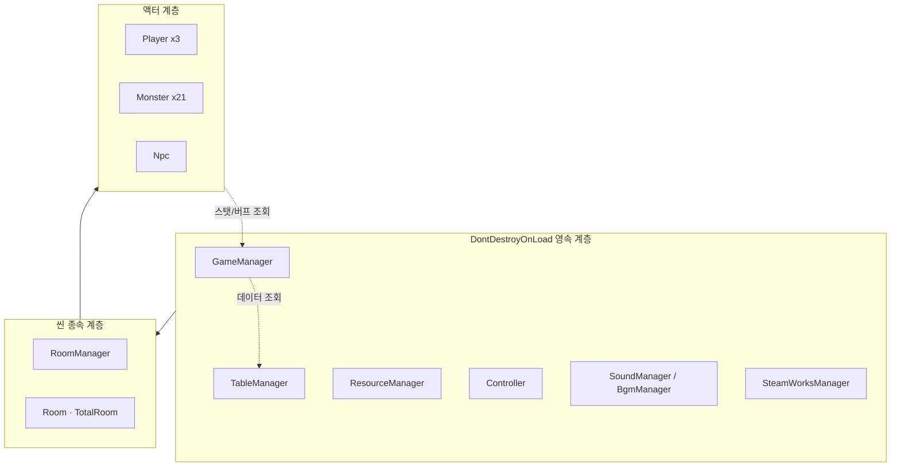
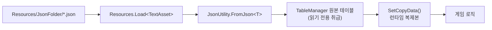
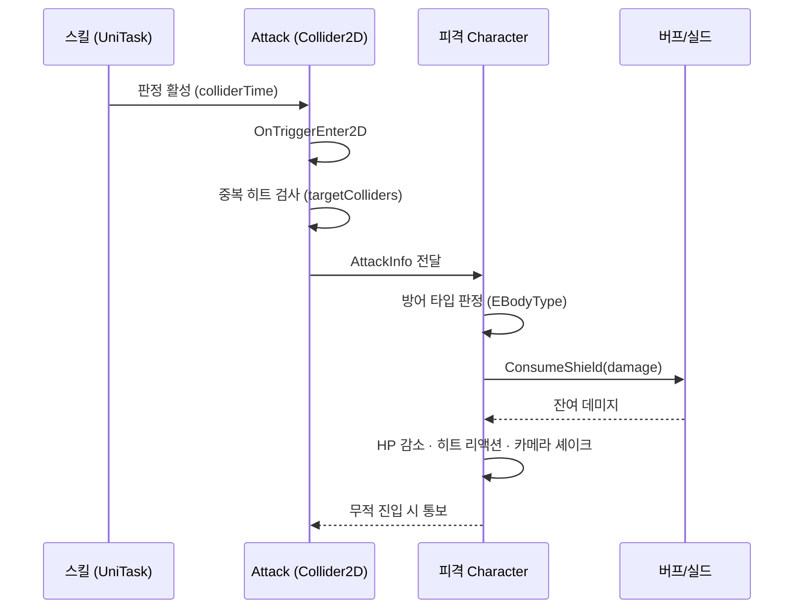
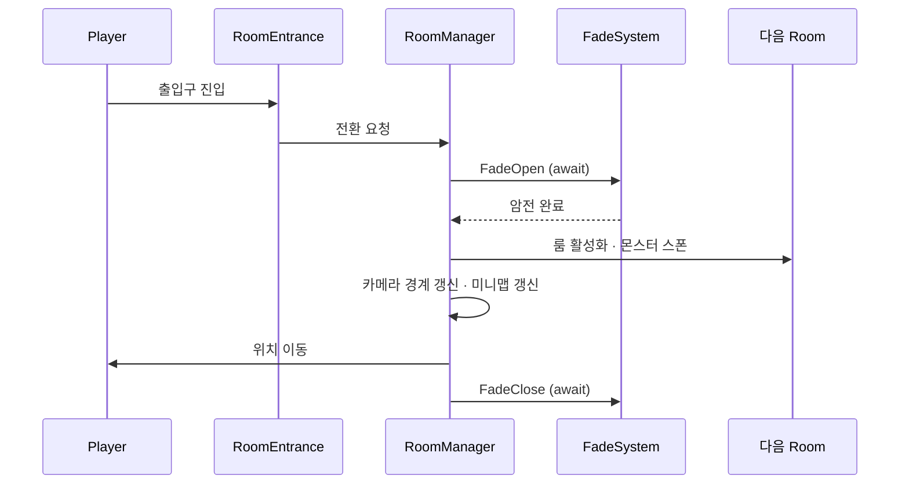
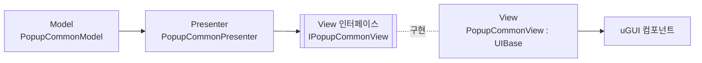

# 아키텍처 문서

> `Damn Adventure` 의 시스템별 설계를 정리한 문서입니다.
> "왜 그렇게 만들었는가"에 대한 배경은 [`TECH-NOTES.md`](TECH-NOTES.md) 를 참고해 주세요.

## 목차

1. [전체 구성](#1-전체-구성)
2. [매니저 계층](#2-매니저-계층)
3. [데이터 레이어](#3-데이터-레이어)
4. [캐릭터 & 상태 머신](#4-캐릭터--상태-머신)
5. [전투 판정 시스템](#5-전투-판정-시스템)
6. [버프 · 실드 시스템](#6-버프--실드-시스템)
7. [스킬 & 특성 트리](#7-스킬--특성-트리)
8. [룸 구성](#8-룸-구성)
9. [UI 계층](#9-ui-계층)
10. [리소스 · 메모리 관리](#10-리소스--메모리-관리)
11. [비동기 정책](#11-비동기-정책)
12. [로컬라이징](#12-로컬라이징)
13. [세이브 · 설정](#13-세이브--설정)
14. [적용한 설계 패턴](#14-적용한-설계-패턴)

---

## 1. 전체 구성

### 씬 구성

| 순서 | 씬 | 역할 |
|---|---|---|
| — | `Logo` | 스플래시 · 초기 부팅 |
| 0 | `Title` | 메인 메뉴, 세이브 슬롯, 설정 |
| 1 | `Battle` | 본편 플레이 |

### 런타임 계층



### 싱글턴 기반 클래스

프로젝트에는 두 종류의 싱글턴 베이스가 있습니다.

| 클래스 | 방식 | 용도 |
|---|---|---|
| `Singleton<T>` | `FindObjectOfType` 기반 | 씬에 이미 배치된 매니저 |
| `SingletonMono<T>` | 스레드 세이프, 인스턴스 자동 생성 | 씬 배치가 필요 없는 순수 매니저 |

`ResourceManager`, `TableManager` 등은 `SingletonMono<T>` 를 사용합니다.

---

## 2. 매니저 계층

| 매니저 | 책임 |
|---|---|
| `GameManager` | 플레이어 상태 · 스탯 · 재화 · 세이브/로드 · 오브젝트 풀 · 아틀라스 캐시 · 키 바인딩 |
| `RoomManager` | 룸 이동, 카메라 경계, 미니맵, 페이드 전환, 게임오버 흐름 |
| `Controller` | 입력 폴링 및 플레이어 액션 디스패치 |
| `ResourceManager` | Addressables 로딩 (동기 / 비동기) |
| `TableManager` | JSON 데이터 테이블 로드 및 조회 |
| `BgmManager` / `SoundManager` | 오디오 재생 |
| `VolumeManager` | AudioMixer 볼륨 제어 |
| `SteamWorksManager` | Steam 플랫폼 연동 |

### 분리된 서비스

`MonoBehaviour` 도 싱글턴도 아닌 순수 클래스입니다.
`GameManager.InitManager()` 에서 생성하며, 기존 호출부는 `GameManager` 가 위임합니다.

| 서비스 | 책임 | 위치 | 테스트 |
|---|---|---|---:|
| `LocalizationService` | 다국어 텍스트 조회 | `Core/Localization/` | 10개 |
| `ObjectPoolService` | 오브젝트 풀 | `Core/Pool/` | 13개 |
| `GameFlowService` | 시간 정지 · 입력 잠금 · 슬로우모션 | `Core/Flow/` | 10개 |
| `TableParse` | 테이블 문자열 파싱 (로케일 고정) | `Util/` | 10개 |
| `RoomMinimap` | 미니맵 공개 상태 | `World/Room/` | 7개 |
| `MinimapCellCodec` | 미니맵 세이브 형식 | `World/Room/` | 9개 |

의존을 생성자로 주입받으므로 Unity 런타임 없이 검증할 수 있습니다.

```csharp
localization = new LocalizationService(tableManager.talkTable, tableManager.itemTable);
pool = new ObjectPoolService(prefabList);
flow = new GameFlowService();
```

**무엇을 뽑을지는 감이 아니라 필드 의존도로 판정했습니다.**
전용 필드가 뚜렷하고 바깥 참조가 초기화뿐인 것만 뽑았고,
필드를 공유하는 책임(보스 이벤트, 문 이동, 성장 로직)은 남겼습니다.
같은 기준을 `GameManager` 와 `Room` 양쪽에 적용했습니다 —
[8절 룸 구성](#8-룸-구성)과
[`TECH-NOTES.md` 12번](TECH-NOTES.md#12-god-object를-어디부터-뜯을지--감이-아니라-측정으로)에 측정 결과가 있습니다.

`GameManager` 자체는 역할별 `partial` 파일 9개로 나뉘어 있습니다.
다만 **파일만 나뉘었을 뿐 클래스는 하나**이므로 결합도는 그대로입니다.

### 입력 처리

`Controller` 가 `Update()` 에서 입력을 폴링하고, 현재 활성 플레이어에게 위임합니다.
모든 키는 `GameManager` 가 보유한 필드를 참조하므로, **리바인딩이 즉시 반영**됩니다.

```csharp
// Controller.cs
if (Input.GetKeyDown(GameManager.Instance.changeCharacterKey))
    // 캐릭터 교체

if (Input.GetKeyDown(GameManager.Instance.skillKey1))
    GameManager.Instance.CurPlayer.Skill(GameManager.Instance.skillKey1);
```

키 값 자체는 `KeyBinding` 유틸을 통해 저장/복원됩니다.

```csharp
changeCharacterKey = KeyBinding.LoadKey(ConstValues.ChangeCharacterKey, KeyCode.LeftShift);
```

이동·물리 관련 처리는 `FixedUpdate()` 로 분리되어 있습니다.

---

## 3. 데이터 레이어

### 로딩 흐름



`TableManager.Init()` 이 20종의 테이블을 일괄 로드합니다.

```csharp
public void Init()
{
    animationsTable      = LoadDataFromJson<AnimationsDataList>(ConstValues.Animations);
    attackTable          = LoadDataFromJson<AttackDataList>(ConstValues.Attack);
    monsterTable         = LoadDataFromJson<MonsterDataList>(ConstValues.Monster);
    skillAttributeTable  = LoadDataFromJson<SkillAttributeDataList>(ConstValues.SkillAttribute);
    spawnedObjectTable   = LoadDataFromJson<SpawnedObjectDataList>(ConstValues.SpawnedObject);
    // … 총 20종
}

private T LoadDataFromJson<T>(string fileName)
{
    var jsonText = Resources.Load<TextAsset>($"JsonFolder/{fileName}");
    var data     = JsonUtility.FromJson<T>(jsonText.text);
    return data;
}
```

### id 조회 인덱스

테이블은 로드 후 변하지 않으므로, `Init()` 마지막에 `id → 데이터` 사전을 만듭니다.

```csharp
// 이전 — 조회할 때마다 전체를 훑고, 람다가 지역 변수를 캡처해 클로저를 할당했다
TableManager.Instance.spawnedObjectTable.SpawnedObject.Find(x => x.id == id);

// 현재
TableManager.Instance.GetSpawnedObject(id);
```

`SpawnedObject`(428개)는 이펙트 생성마다, `Attack`(152개)은 공격 판정마다 조회되던 경로입니다.
런타임 복제본(`skillAttributeCopyList` 등)도 같은 방식으로 인덱싱했으며,
특성 조회는 `FindAll` 이라 **호출마다 결과 `List` 를 새로 할당**하던 것을 없앴습니다.

**인덱스를 만들지 않은 것**

| 대상 | 이유 |
|---|---|
| 세이브 데이터 리스트 | `JsonUtility` 가 `Dictionary` 를 직렬화하지 못해 세이브 호환성이 깨집니다. 항목도 3~20개입니다 |
| `buffList`, `players` 등 런타임 상태 | 10개 미만이라 해시 오버헤드가 더 큽니다 |
| 조건 필터형 `FindAll` 1건 | 키 조회가 아니라 여러 조건으로 걸러내는 코드입니다 |

id 가 중복되면 `Init()` 에서 경고를 남깁니다.
`List` 는 중복을 허용하지만 `Dictionary` 는 거부하므로, 이 전환 과정에서
`Monster` 테이블의 중복 id 2건이 드러났습니다
([`TECH-NOTES.md` 14번](TECH-NOTES.md#14-dictionary로-바꿨더니-데이터-버그가-나왔다)).

### 원본 불변 · 복제본 가변 원칙

**게임 중 변하는 데이터는 절대 원본 테이블에 쓰지 않습니다.**
스킬 특성처럼 런타임에 상태가 바뀌는 데이터는 `SetCopyData()` 에서 별도 복제 클래스로 만듭니다.

```csharp
private void SetCopyData()
{
    foreach (var skillAttribute in tableManager.skillAttributeTable.SkillAttribute)
    {
        var data = new SkillAttributeCopy();
        data.id   = skillAttribute.id;
        data.cost = skillAttribute.cost;
        // …
    }
}
```

원본이 오염되면 **재시작 없이는 복구할 수 없는** 버그가 됩니다.
새 세이브 파일 시작 시 모든 성장 요소가 초기화되어야 하므로, 이 경계가 특히 중요합니다.

### 다중 값 표기 규칙

`JsonUtility` 는 중첩 배열 표현이 제한적이므로,
**세미콜론(`;`) 구분자**로 다중 값을 표기하고 로드 시점에 파싱합니다.

```jsonc
{ "id": "PotionDrink", "coolTime": "0.1;0;0" }   // 캐릭터별 쿨타임 3종
{ "passiveId": "SuperArmor;ArmorBreak" }          // 다중 패시브
```

```csharp
var passiveIdSplit = skillAttribute.passiveId.Split(';');
foreach (var passiveId in passiveIdSplit)
    data.passiveId.Add(passiveId);
```

### 테이블 목록

| 테이블 | 내용 |
|---|---|
| `Player.json` | 직업별 기본 스탯 |
| `Monster.json` | 몬스터 스탯 및 AI 패턴 |
| `Attack.json` | 공격 판정 프레임 데이터 |
| `Skill.json` / `SkillAttribute.json` | 스킬 정의 / 특성 트리 |
| `Passive.json` | 패시브 효과 |
| `Relic.json` | 유물 패시브 보너스 |
| `Buff.json` | 상태이상 지속시간 · 중첩 규칙 |
| `Missile.json` / `Grenade.json` | 투사체 정의 |
| `SpawnedObject.json` | 생성 오브젝트 정의 (최대 규모) |
| `Rooms.json` | 룸 연결 · 레이아웃 메타 |
| `Arena.json` | 아레나 라운드 구성 |
| `Item.json` / `StoreItem.json` | 아이템 · 상점 |
| `Npc.json` | NPC 정의 |
| `Dialogue.json` / `DialogueChoice.json` / `ProductDialogue.json` | 대사 · 분기 |
| `Talk.json` | 8개 언어 UI/설명 텍스트 |
| `Animations.json` | 애니메이션별 이동 허용·반전 여부 |

---

## 4. 캐릭터 & 상태 머신

### 상속 구조

```
Character                      // 상태 머신 · 버프/실드 · HP/MP · 방어 타입
├── Player
│   ├── Player_Fighter         // 전기 근접
│   ├── Player_Gunner          // 원거리 + 속성 부여
│   └── Player_Berserker       // 대검 + 저스트 카운터
├── Monster                    // 21종
└── Npc                        // 상인 · 시스템 · 동료 등
```

플레이어·몬스터·NPC가 **같은 기반 클래스를 공유**하므로,
버프·상태이상·피격 반응 로직을 한 번만 구현하면 모든 액터에 적용됩니다.

### 상태 축의 분리

캐릭터 상태를 하나의 enum으로 다루면 조합 폭발이 일어나므로 **세 축으로 분리**했습니다.

```csharp
public enum ENormalState   // 행동 상태 (21종)
{
    Normal, Idle, Move, Jump, Landing, Leap,
    Attack, JumpAttack, Dash, Skill, Potion,
    Grabbed, Airborne, Down, Stun, Damaged,
    Appear, AppearEnd, Die, Stagger, Frozen
}

public enum EMoveState     // 실제 이동 여부
{
    Stopping, Moving
}

public enum ELandingState  // 접지 여부
{
    Ground, Air
}
```

"공중에서 이동 중 스킬 시전" 같은 상황이 `Skill` + `Moving` + `Air` 조합으로 표현됩니다.
단일 enum이었다면 상태 수가 21 × 2 × 2 로 늘어났을 것입니다.

### 방어 타입

```csharp
public enum EBodyType
{
    Normal,       // 모든 타격에 경직
    SuperArmor,   // 경직 무시, 상태이상으로 파괴됨
    HeavyArmor,   // 경직 무시, 상태이상은 걸리나, 공중에 뜨지 않음
    StrongArmor,  // 보스 전용, 무력화 게이지를 다 깎으면 그로기 시간동안 Normal판정으로 변함
    HyperArmor,   // 보스 전용, 무력화 게이지를 다 깎으면 그로기, 대신 공중에 뜨지 않음
    UnChange,     // 보스 전용, 모든 경직 및 에어본 무시
    Counter,      // 피격 시 반격으로 전환
}
```

**"경직되는가"와 "공중에 뜨는가"는 별개의 축입니다.**
`HeavyArmor` 와 `HyperArmor` 는 무너지더라도 에어본만은 막는데,
보스를 띄워 공중 콤보로 끝내는 패턴이 생기면 무력화 시스템이 무의미해지기 때문입니다.

### 무력화 게이지

`StrongArmor` 와 `HyperArmor` 에만 무력화 게이지가 붙습니다 (보스 체력바 아래).
타격이 누적돼 게이지가 소진되면 그로기 상태가 됩니다.

```csharp
// Attack.cs — 스태거 누적 후 무력화 판정
if (!hitTarget.ImmuneStagger && hitTarget.BasicStat.stagger <= 0 &&
    hitTarget.OriginStat.bodyType is EBodyType.StrongArmor or EBodyType.HyperArmor)
{
    hitTarget.Stagger();
    return true;
}
```

등급을 깎는 경로는 두 갈래입니다.

| 대상 | 수단 | 결과 |
|---|---|---|
| `SuperArmor` (잡몹) | `ArmorBreak` 상태이상 | `Normal` 로 강등 |
| `StrongArmor` (보스) | 무력화 게이지 소진 | 그로기 동안 `Normal` 로 강등 |
| `HyperArmor` (보스) | 무력화 게이지 소진 | 그로기. 공중에는 뜨지 않음 |
| `UnChange` (보스) | 없음 | 연출 · 특수 패턴 구간용 |

강등은 `basicStat` 에만 적용하고 `originStat` 은 건드리지 않습니다.
**원본 등급이 남아 있어야 그로기가 끝난 뒤 되돌릴 수 있기 때문입니다.**

```csharp
case EBuffType.Stagger:
    if (originStat.bodyType == EBodyType.StrongArmor)   // 원본을 보고
        basicStat.bodyType = EBodyType.Normal;          // 현재만 바꾼다
    break;
```

방어 타입은 **스킬 실행 중 동적으로도 변경**됩니다.
예: 버서커 `SwordCounter` 는 시전과 동시에 `Counter` 로 전환됩니다.

```csharp
StateSetting(ENormalState.Skill, ConstValues.BerserkerSwordCounter, …);
BodyTypeSetting(EBodyType.Counter);
```

스킬 특성으로 방어 타입을 부여할 수도 있습니다
(`SwiftSlash` 특성 → `passiveId: "SuperArmor"`).

---

## 5. 전투 판정 시스템

### 판정 흐름



### AttackInfo

공격 1회에 대한 모든 정보가 하나의 데이터 클래스에 담깁니다.

```csharp
public class AttackInfo
{
    public string id;
    public EEffectType effectType;      // Damaged / Airborne 등 히트 리액션
    public float effectTime;
    public List<DeBuffInfo> deBuffInfoList;

    public bool ignoreSuperArmor;       // 슈퍼아머 관통
    public bool ignoreImmortal;         // 무적 관통
    public bool respawnAttack;
    public bool destroyProjectile;
    public bool continuous;             // 지속 판정
    public float continuousDelay;
    public bool duplicate;              // 다단 히트 허용

    public EDirectionType directionType;
    public int coefficient;             // 데미지 계수
    public int criticalChance;
    public int stagger;                 // 경직 강도
    public int gainResource;
    public float knockBack;
    public Vector2 upperPower;          // 띄우기 힘
    public int customDir;

    public float colliderTime;          // 판정 지속 시간
    public Vector2 hitShake;            // 카메라 셰이크 강도
    public float shakeTime;
    public string hitEffectId;
}
```

이 값들은 `Attack.json` 에서 로드된 `AttackData`(문자열 중심)를
런타임 타입(`enum` · `Vector2` · `List`)으로 변환한 결과입니다.
**JSON은 편집 편의를, 런타임은 타입 안정성을 갖도록** 두 층으로 나눴습니다.

### 무적 상태와 지속 판정

지속 판정(`duplicate`) 공격이 무적 상태 대상과 겹치면,
무적이 풀린 뒤 다시 맞아야 자연스럽습니다.
이를 위해 무적으로 진입한 타겟을 추적합니다.

```csharp
// 지속형(duplicate) 공격에서 무적 상태로 진입한 타겟.
// 무적이 풀리는 즉시 myCollider를 다시 켜기 위해 추적.
private Character immortalWaitTarget;
```

### 투사체

`IProjectile` 인터페이스 아래 3종이 구현되어 있습니다.

| 클래스 | 특성 |
|---|---|
| `Missile` | 직선/유도 발사체, `Missile.json` 기반 |
| `Grenade` | 포물선 + 폭발 판정, `Grenade.json` 기반 |
| `LaserBeam` | 지속 판정 빔 |

---

## 6. 버프 · 실드 시스템

### 버프 구조

```csharp
[Serializable]
public class Buff
{
    public string buffId;
    public EBuffType buffType;
    public int buffValue;

    public float buffTime;      // 총 지속시간
    public float currentTime;   // 남은 시간
    public int buffCount;       // 총 중첩
    public int currentCount;

    public float tickInterval;  // 틱 간격
    public float nextTickTime;  // 다음 틱까지 대기시간

    public Action endAction;    // 만료 콜백
    public Action tickAction;   // 틱마다 실행 (연출/피해)
}
```

`tickInterval` 을 0으로 두면 즉시형(빙결·기절),
값을 주면 지속형(화상·감전)이 됩니다. **하나의 구조로 두 종류를 모두 표현**합니다.

### 버프 타입

```csharp
public enum EBuffType
{
    // 제어
    Stun, Stagger, ArmorBreak, Frozen, Shock, Burn,

    // 강화
    AttackSpeedUpPercent, MoveSpeedUpPercent, Shield, PowerUpPercent,

    // 속성 부여
    ElementalIce, ElementalLightning, ElementalFire,
}
```

### 실드 소비 규칙

```csharp
[Serializable]
public class Shield
{
    public string sourceId;   // 출처(스킬/유물 id) — 식별·디버깅용
    public int amount;        // 남은 실드량
    public float duration;    // 총 지속시간 (0 이하 = 무한)
    public float currentTime; // 남은 시간
    public int priority;      // 소비 우선순위 (작을수록 먼저)
    public Action endAction;  // 만료/소진 콜백
}
```

```csharp
public int ConsumeShield(int damage)
{
    if (damage <= 0 || shieldList.Count == 0)
        return damage;

    shieldList.Sort((a, b) =>
    {
        int p = a.priority.CompareTo(b.priority);
        if (p != 0) return p;

        // 무한(duration <= 0) 실드는 가장 나중에 소비
        float at = a.duration > 0 ? a.currentTime : float.MaxValue;
        float bt = b.duration > 0 ? b.currentTime : float.MaxValue;
        return at.CompareTo(bt);
    });

    for (int i = 0; i < shieldList.Count && damage > 0; i++)
    {
        // 앞에서부터 소진
    }
}
```

정렬 기준: **우선순위 → 잔여시간 짧은 순 → 무한 실드**.
남은 데미지를 반환하므로 호출부는 `ConsumeShield` 결과만 HP에서 차감하면 됩니다.

---

## 7. 스킬 & 특성 트리

### 스킬 정의

```jsonc
{
  "id": "Berserker_Dash",
  "type": "Dash",
  "caster": "Berserker",
  "coolTime": 1,
  "skillSpeed": 1,
  "skillArmor": "Normal",   // 시전 중 방어 타입
  "talk": 60001,            // 이름 (Talk.json 참조)
  "explainTalk": 70001      // 설명 (Talk.json 참조)
}
```

스킬 이름과 설명이 **텍스트가 아니라 `idx` 참조**이므로, 로컬라이징과 자동 연동됩니다.

### 특성 트리

```jsonc
{
  "id": "SwiftSlash",
  "kExplain": "돌진베기 및 슈퍼아머",
  "skill": "Berserker_UpperSlash",   // 어떤 스킬에 붙는가
  "cost": 3,                          // 해금 비용
  "passiveId": "SuperArmor",          // 부여 패시브
  "addObjectId": "",                  // 추가 생성 오브젝트
  "upgradeId": "SpeedUp",             // 수치 강화 종류
  "upgradeValue": 70,
  "buffId": "", "deBuffId": "",
  "firstLock": 0
}
```

특성은 4가지 방향으로 스킬을 변형시킵니다.

| 필드 | 효과 |
|---|---|
| `upgradeId` / `upgradeValue` | 수치 강화 (시전속도, 데미지 등) |
| `passiveId` | 방어 타입·패시브 부여 |
| `addObjectId` / `objectId` / `objectCount` | 투사체·오브젝트 추가 생성 |
| `buffId` / `deBuffId` | 버프·디버프 부착 |

### 코드에서의 특성 조회

스킬 구현부는 특성 보유 여부만 확인해 분기합니다.

```csharp
private async UniTask<bool> SwordCounter()
{
    var skillId = ConstValues.BerserkerSwordCounter;
    bool vibratingSteel = GameManager.Instance.IsHaveAttribute(skillId, ConstValues.VibratingSteel);
    bool bullCharge     = GameManager.Instance.IsHaveAttribute(skillId, ConstValues.BullCharge);

    float justTime = 0.15f;   // 저스트 카운터 판정 창
    // …
}
```

특성 추가 = **JSON 한 줄 + 분기 한 줄**. 신규 스킬 시스템을 다시 만들 필요가 없습니다.

---

## 8. 룸 구성

### 구성 요소

| 클래스 / 파일 | 줄수 | 책임 |
|---|---:|---|
| `Room.cs` | 1,469 | 방 상태, 몬스터 스폰, NPC 배치, 카메라 경계, 미니맵 마커 |
| `Room.Product.cs` (`partial`) | 2,005 | 방에서 벌어지는 연출 — 스토리·보스 등장·문 열림·아레나·퀘스트 |
| `Room.InfoSetting.cs` (`partial`) | 775 | 세이브 스키마 동기화 · 저장 상태 복원 |
| `RoomMinimap` | 324 | 미니맵 공개 상태 (`MonoBehaviour` 아님) |
| `MinimapCellCodec` | 72 | 방문 셀 저장 형식 (순수 정적) |
| `RoomManager` | 554 | 룸 간 비동기 페이드 전환, 카메라 인계, 게임오버 흐름 |
| `TotalRoom` | — | 전체 룸 컨테이너 |
| `Arena` | — | 라운드 기반 전투 구역 (`Arena.json` 으로 웨이브 구성) |
| `RoomEntrance` / `ShortcutObject` | — | 룸 출입구, 지름길 개통 |

### 무엇을 뽑고 무엇을 남겼나

`Room.cs` 는 한때 **4,444줄**이었습니다. "방에 관련된 모든 것"이 한 클래스에 있었기 때문입니다.
분해할 때 파일을 옮기는 건 쉽지만, **필드를 공유하면 실제로는 갈라지지 않습니다.**
그래서 책임별로 어떤 필드를 쓰는지 먼저 셌습니다.

| 책임 | 쓰는 필드 | 공유 관계 | 판정 |
|---|---:|---|---|
| 보스 이벤트 | 14개 | `bosses` · `npc` · `roomInfo` · `customObjects` | 분리 불가 |
| 문 / 방 이동 | 16개 | `roomInfo` · `roomsData` · `shortCutObjects` | 분리 불가 |
| 스토리 연출 | 11개 | 공유는 적으나 재사용 없는 일회성 코드 | **파일만 분리** |
| 미니맵 | 21개 (전용 9개) | 바깥 참조가 `Awake` 초기화뿐 | **클래스로 추출** |

미니맵 전용 필드 9개(`visitedFrameCells`, `originalFrameTiles`, `minimapFrameTilemap` 등)를
`Room` 의 다른 코드가 건드리는 곳은 `Awake` 의 초기화가 전부였습니다.
생성자 인자로 넘기면 끝나는 관계 — 자리만 `Room` 안이었을 뿐 원래부터 독립된 기능이었습니다.

```csharp
// Room.Awake()
minimap = new RoomMinimap(minimapFrameTilemap, minimapInTilemap, shortcutFrameTileMaps, hiddenAreas);
minimap.CacheTiles();

// 세이브 데이터가 붙는 시점
minimap.Bind(roomInfo);
minimap.Restore();
```

**미니맵 마커(세이브 포인트·포탈·상인·획득물)는 `Room` 에 남겼습니다.**
미니맵 전용 데이터가 아니라 방이 소유한 오브젝트이고,
공개 조건이 "이미 먹었는가" 같은 방 상태에 걸려 있어 옮기면 오히려 결합이 늘어납니다.

> `partial` 로 나눈 것과 클래스로 뽑은 것을 구분해 적었습니다.
> `partial` 은 파일만 가를 뿐 **결합을 줄이지 않습니다.**
> `Room.Product.cs` 의 코드는 여전히 `Room` 의 필드를 그대로 씁니다.

### 미니맵 공개 판정

미니맵은 "그려둔 타일을 전부 지웠다가 방문한 만큼 다시 칠하는" 방식입니다.
그래서 `Awake` 에서 원본 타일을 캐싱해 둡니다.

카메라 시야에 조금이라도 걸친 셀을 공개하는데, 같은 겹침 판정이
**미니맵 셀 3종 + 마커 4종, 총 일곱 곳에 복사**돼 있었습니다.

```csharp
// RoomMinimap.Overlaps — 일곱 곳을 한 곳으로
public static bool Overlaps(Rect viewRect, Vector2 center, Vector2 half)
{
    return center.x + half.x >= viewRect.xMin && center.x - half.x <= viewRect.xMax &&
           center.y + half.y >= viewRect.yMin && center.y - half.y <= viewRect.yMax;
}
```

판정 사각형은 카메라 사각형보다 위로 넓힙니다. 미니맵 타일이 방보다 위쪽에 그려져 있어,
카메라 사각형을 그대로 쓰면 화면에 보이는 구역이 미니맵에 늦게 칠해지기 때문입니다.
이 보정은 테두리 → 내부 순으로 **누적**되고, 누적된 값을 마커·숏컷·숨겨진 구역이 함께 씁니다.
그래서 `RevealFrameAndInCells` 가 보정된 사각형을 **반환**하고 `Room` 이 그대로 넘깁니다.

### 미니맵 세이브 형식

`JsonUtility` 가 `Vector3Int` 리스트를 다루지 못해 문자열로 눌러 담습니다.

```
"12_-3_0;13_-3_0;13_-2_0;"
```

이 직렬화 코드가 **네 곳에 복사**돼 있었습니다 — 테두리·내부·숏컷(`Room`) + 숨겨진 구역(`HiddenArea`).
세이브 파일 형식인데 네 곳에 흩어져 있으면 한 곳만 고쳐도 세이브가 깨집니다.
`MinimapCellCodec` 하나로 모으고 테스트를 붙였습니다.

깨진 항목은 **건너뛰고 나머지를 살립니다.** 세이브가 손상됐을 때 방 하나가 통째로
안 열리는 것보다, 복원 가능한 셀만 살리고 나머지를 다시 탐색하게 두는 편이 낫습니다.

> 에피소드 연출을 담당하던 `Stage` / `Stage1` / `Stage2` / `StageManager` 는
> **2챕터 컨셉 변경 과정에서 제거**했습니다 (커밋 `사용 않는 스크립트 제거`).
> 연출 시퀀싱은 재설계 중이며, 현재 룸 단위 흐름은 `RoomManager` 가 담당합니다.

### 룸 전환 흐름



전환 전 구간이 `UniTask` 로 이어져 있어, **암전이 끝나기 전에 다음 룸이 보이는 문제**가 구조적으로 발생하지 않습니다.

### 페이드 시스템

`FadeSystem` 은 대상 컴포넌트 종류를 가리지 않고 동작합니다.

```csharp
myImage         ?.DOFade(endAlpha, duration).SetUpdate(ignoreTime).SetEase(myEase);
myText          ?.DOFade(endAlpha, duration).SetUpdate(ignoreTime).SetEase(myEase);
mySpriteRenderer?.DOFade(endAlpha, duration).SetUpdate(ignoreTime).SetEase(myEase);
```

`SetUpdate(ignoreTime)` 로 **일시정지 중에도 UI 페이드가 동작**하도록 처리했습니다.
포즈 팝업이 열려 시간이 멈춰도 연출은 멈추지 않습니다.

> 시간 정지 자체는 `GameFlowService` 가 관리합니다.
> 팝업이 `Time.timeScale` 을 직접 건드리지 않고 **정지를 요청**하는 방식이며,
> 이유는 [11절 비동기 정책](#11-비동기-정책) 아래 "시간 정지와 입력 잠금"에 있습니다.

### 룸 데이터

`Rooms.json` 이 룸 연결·레이아웃 메타를 보유하고,
룸 프리팹 59개가 실제 배치를 담습니다.

룸 프리팹의 타일맵은 **`GroundTileMap` / `PlatformTileMap` 두 개만 충돌·이동 판정에 사용**됩니다.
(`MinimapFrameTileMap`, `MinimapInTileMap` 등은 미니맵 전용)

---

## 9. UI 계층

### MVP 구조



```csharp
public interface IPopupCommonView
{
    void SetTitle(string title);
    void SetDesc(string desc);
    void SetButton(UIButtonData data);
    void SetClose(Action onClose);
}

public class PopupCommonModel
{
    public string Title;
    public string Desc;
    public UIButtonData ButtonData;
}

public class PopupCommonPresenter        // MonoBehaviour 아님 → 단위 테스트 가능
{
    private readonly IPopupCommonView _view;
    private readonly PopupCommonModel _model;

    public PopupCommonPresenter(IPopupCommonView view, PopupCommonModel model)
    {
        _view = view;
        _model = model;

        _view.SetTitle(_model.Title);
        _view.SetDesc(_model.Desc);
        _view.SetButton(_model.ButtonData);
        _view.SetClose(OnClose);
    }
}

public class PopupCommonView : UIBase, IPopupCommonView   // uGUI 바인딩
{
    private PopupCommonPresenter presenter;
    public PopupCommonPresenter Presenter => presenter;

    // View 가 자기 Presenter 를 조립한다
    public PopupCommonPresenter Bind(PopupCommonModel model)
    {
        presenter = new PopupCommonPresenter(this, model);
        return presenter;
    }
}
```

Presenter가 `MonoBehaviour` 를 상속하지 않는 것이 핵심입니다.
View를 인터페이스로만 알고 있으므로 **Unity 런타임 없이 테스트할 수 있는 형태**입니다.

### 조립은 View 가 한다

호출부는 한 줄입니다.

```csharp
popupStore.StoreView.Bind(storeModel).SetAction();
uiInterface.GoodsView.Bind(new UIGoodsModel { totalGold = Gold }).SetGoldText();
```

예외는 두 가지입니다. **View 하나가 자기 것만 조립하는 방식으로는 만들 수 없는 경우**라,
해당 View 들을 모두 가진 `UI_Interface` 가 조립합니다.

```csharp
public UIBossHpPresenter BindBossHp()                  // Model 이 없다
public UISkillPresenter  BindSkill(UISkillModel model) // 교체/포션/일반 스킬 View 3종을 함께 다룬다
```

### 화면 목록

| 분류 | 구성 |
|---|---|
| **기반** | `UIBase` (패널 공통), `UICanvas` (해상도 대응) |
| **HUD** | `UIHpView`, `UISkillView`, `UIComboView`, `UIGoodsView`, `UIBossHpView`, `UIBossMessageView`, `UIEpisodeView`, `UIPlaceNameView`, `UIStageClearView`, `UICharacterFaceView`, `UIObjectInfoView` |
| **팝업** | `PopupAttributeView`(특성 트리), `PopupCharacterView`, `PopupRelicView`, `PopupSkillView`, `PopupStoreView`, `PopupMinimapView`, `PopupFastTravelView`, `PopupGameOverView`, `PopupPauseView`, `PopupSettingView`, `PopupAudioView`, `PopupVideoView`, `PopupKeyboardView`, `PopupSelectView`, `PopupWarningView`, `PopupGuideView`, `PopupItemView`, `PopupCommonView` |
| **상호작용** | `InteractionObject`(액션 키 프롬프트), `InteractionSelect`(다중 선택), `RoomTreasureBox`, `RoomSkillAndPassive` |
| **대사** | `SpeechFrame` — 초상화 + 분기 선택 |

인터페이스 정의는 총 **33개** (`IPopup*View` 21 + `IUI*View` 12).

### UI 전용 관리자를 두지 않은 이유

초기에는 `UIManager` 가 있었습니다. 기존 팝업이 이미 풀 API로 동작하고 있어 전환을 미뤘고,
오래 방치된 끝에 제거했습니다(커밋 `사용 않는 스크립트 제거`).

이후 "관리자를 다시 세울 것인가"를 검토했는데, 다시 만들지 않기로 했습니다.

**생성 경로는 이미 하나입니다.** UI든 일반 오브젝트든 전부 `ObjectPoolService.Spawn()` 을
탑니다. 부모 `Transform` 만 다릅니다.

```csharp
SpawnToObjectPool(id, pos)   → pool.Spawn(id, objectPool, pos)
SpawnToUIPool(type, pos)     → pool.Spawn(id, uiPool,     pos)
SpawnToPopupPool(type, pos)  → pool.Spawn(id, popupPool,  pos)
```

여기에 관리자를 더하면 **위임 껍데기가 하나 늘어날 뿐**입니다.

**실제 문제는 생성이 아니라 조립이었습니다.** MVP 를 엮는 코드가 35곳에 흩어져 있었고,
호출부마다 다섯 단계를 손으로 반복했습니다. 그래서 관리자를 만드는 대신
**조립의 주인을 View 로 정했습니다**(위 참고).

> 팝업 스택·ESC 우선순위처럼 **여러 팝업의 관계를 한 곳에서 봐야 하는 요구**가 생기면
> 그때 얇은 계층을 두는 것이 맞습니다. 지금 규모에서는 과설계입니다.

---

## 10. 리소스 · 메모리 관리

### Addressables

3개 그룹으로 분리되어 있습니다.

| 그룹 | 대상 |
|---|---|
| `Default Local Group` | 공통 리소스 |
| `UI` | HUD 관련 |
| `Popup` | 팝업 화면 |

`ResourceManager` 는 동기·비동기 로더를 모두 제공하며,
**키 존재 여부를 먼저 확인**해 없는 키에 대해 예외 대신 `default` 를 반환합니다.

```csharp
public async UniTask<T> LoadAssetAsync<T>(string path)
{
    // 키에 맞는 번들이 존재하는지 확인 후 리소스를 리턴한다
    var locations = await Addressables.LoadResourceLocationsAsync(path).Task;
    if (locations.Any())
        return await Addressables.LoadAssetAsync<T>(path).Task;

    return default(T);
}
```

로딩 실패가 **게임 전체를 중단시키지 않도록** 설계했습니다.

### 스프라이트 아틀라스 캐싱

아틀라스에서 매번 `GetSprite(name)` 을 호출하면 내부 탐색 비용이 발생하므로,
초기화 시 한 번에 펼쳐 딕셔너리에 담습니다.

```csharp
private void InitAtlas(SpriteAtlas spriteAtlas)
{
    // Atlas 안에 들어있는 스프라이트 개수만큼 배열 생성
    cloneSprites = new Sprite[spriteAtlas.spriteCount];
    spriteAtlas.GetSprites(cloneSprites);          // 한 번에 채워진다

    foreach (var sprite in cloneSprites)
    {
        // "Icon_Sword(Clone)" → "Icon_Sword"
        var keyName = sprite.name.Split(ConstValues.AtlasClone)[0];
        atlasDic.Add(keyName, sprite);
    }
}

public Sprite GetAtlasSprite(string id) => atlasDic[id];
```

UI · 배경 2종의 아틀라스에 적용되어 있으며, 조회는 **O(1)** 입니다.

### 오브젝트 풀

용도별로 **5개 부모 Transform** 을 분리 운영합니다.

| 풀 | 용도 |
|---|---|
| `objectPool` | 몬스터 · 투사체 · 이펙트 등 월드 오브젝트 |
| `uiObjectPool` | 데미지 텍스트 등 월드 상의 UI 오브젝트 |
| `uiPool` | HUD 화면 |
| `popupPool` | 팝업 화면 |
| `highestPool` | 항상 최상단에 그려져야 하는 요소 |

분리 이유는 **계층 정리 + 렌더 순서 제어**를 동시에 얻기 위해서입니다.
uGUI는 형제 순서(sibling index)가 곧 렌더 순서이므로, 부모를 나누면 레이어 관리가 단순해집니다.

풀 로직은 `ObjectPoolService`(`Core/Pool/`)에 있습니다.
`MonoBehaviour` 가 아니므로 EditMode 테스트가 가능하고, `GameManager` 는 위임만 합니다.

**재사용 규칙** — 같은 id 의 인스턴스 중 비활성인 것을 앞에서부터 찾아 재사용하고, 없으면 새로 만듭니다.

```csharp
// 프리팹 이름 -> 프리팹 (스폰마다 하던 선형 탐색을 없앤다)
private readonly Dictionary<string, GameObject> prefabById;

// 프리팹 이름 -> 그 id 로 만들어진 인스턴스들 (생성 순서 유지)
private readonly Dictionary<string, List<GameObject>> instancesById;

public GameObject Spawn(string id, Transform parent, Vector3 position, bool asLastSibling = false)
{
    var go = GetRecyclable(id) ?? Create(id, parent);
    if (!go)
        return null;                 // 프리팹이 없으면 경고 후 null (이전에는 크래시)

    go.transform.position = position;
    go.SetActive(true);
    ResetParticles(go);              // 파티클 잔상 제거
    return go;
}
```

`ResetParticles()` 로 **재사용 시 이전 파티클 잔상이 남는 문제**를 처리합니다.
풀링에서 자주 놓치는 지점입니다.

이전 구현은 전체 인스턴스를 `GameObject.name` 으로 훑었습니다.
`.name` 은 네이티브 접근이라 읽을 때마다 문자열을 할당하므로, 조회 비용이 그대로 GC 부담이 됐습니다.
자세한 측정은 [`TECH-NOTES.md` 13번](TECH-NOTES.md#13-520배-빨라진-이유는-알고리즘이-아니었다)에 있습니다.

| | 조회 시간 | 호출당 할당 |
|---|---|---|
| 이전 | 36,122 ms | 3,565 B |
| 이후 | 69 ms | **0 B** |

> 인스턴스 3,000개 / 조회 20,000회 기준. 시간 차이는 인스턴스 수에 비례하므로
> 실제 게임 규모에서는 체감되지 않습니다. 규모와 무관한 것은 할당이 0이 된 부분입니다.

### 참조 탐색 정책

`GameObject.Find` / `FindObjectOfType` 는 **전체 코드베이스에서 2회**만 사용합니다.
나머지 참조는 인스펙터 주입 또는 매니저 경유로 해결합니다.
문자열 기반 탐색은 비용도 크지만, **이름 변경 시 컴파일 에러 없이 깨지는** 문제가 더 큽니다.

---

## 11. 비동기 정책

### UniTask 채택

코루틴 대신 `UniTask` 를 전면 사용합니다.

- 사용 파일 **58개**
- `CancellationToken` 전파 파일 **46개**

| 코루틴 대비 이점 | 이 프로젝트에서의 의미 |
|---|---|
| 반환값을 가질 수 있음 | 스킬이 `UniTask<bool>` 로 **성공/취소 여부를 반환** |
| GC 할당 최소화 | 전투 중 빈번한 연출 대기에서 유리 |
| 취소 토큰 지원 | 캐릭터 사망·씬 전환 시 진행 중 연출 정리 |
| `await` 조합 가능 | 룸 전환처럼 여러 단계를 순차 조합 |

모든 스킬은 다음 시그니처를 따릅니다.

```csharp
private async UniTask<bool> SwordCounter()
```

`bool` 반환으로 **스킬이 중간에 끊겼는지**를 호출부가 알 수 있습니다.
카운터 실패, 자원 부족, 상태 이상으로 인한 중단이 모두 이 값으로 표현됩니다.

### 취소 토큰 전파

```csharp
protected async UniTask NormalDelay(float second, CancellationTokenSource tokenSource)
{
    await UniTask.Delay(TimeSpan.FromSeconds(second), cancellationToken: tokenSource.Token);
}
```

지연 대기를 이 헬퍼로 통일해, **토큰을 빠뜨리는 실수를 구조적으로 줄였습니다.**

### Forget 패턴

결과를 기다릴 필요가 없는 연출은 `Forget()` 으로 명시합니다.

```csharp
popupPause.FadeOpen(true, true, 0.2f, false).Forget();   // 기다리지 않음
await popupPause.FadeClose(true, true, 0.2f, true);      // 완료를 기다림
```

"의도적으로 기다리지 않음"과 "await를 깜빡함"이 코드상 구분됩니다.

### 시간 정지와 입력 잠금

팝업이 열리면 게임을 멈춰야 합니다. 원래는 각 팝업이 직접 값을 넣었습니다.

```csharp
// 이전 — UIBase
if (timeStop)  Time.timeScale = 0f;
if (timeReset) Time.timeScale = 1f;
```

팝업이 하나뿐일 때는 맞지만, **팝업 위에 팝업이 뜨면 어긋납니다.**

```
① 특성 팝업 열림       timeScale = 0
② 구매 확인 팝업 열림   timeScale = 0
③ 확인 팝업 닫힘       timeScale = 1   ← 특성 팝업은 열려 있는데 게임이 돌아간다
```

특성 팝업에서 구매를 누르면 확인 팝업이 뜨므로 **실제로 도달하는 경로**였습니다.
입력 잠금(`ControlStart`)도 구조가 같았습니다.

`GameFlowService` 는 **"누가 멈춰달라고 했는지"를 집합으로** 들고 있습니다.
요청자가 하나라도 남아 있으면 멈춘 상태를 유지하고, 마지막 요청자가 풀릴 때만 되돌립니다.

```csharp
private readonly HashSet<object> timeHolders = new HashSet<object>();

public void StopTime(object owner)
{
    if (owner == null || !timeHolders.Add(owner)) return;
    Apply();
}

public void ResumeTime(object owner)
{
    if (owner == null || !timeHolders.Remove(owner)) return;
    Apply();
}

private void Apply() => Time.timeScale = timeHolders.Count > 0 ? 0f : baseTimeScale;
```

**중첩 깊이가 아니라 요청자 신원으로 셉니다.** 깊이 카운터를 쓰면 같은 팝업이 실수로
두 번 풀었을 때 값이 음수로 내려가 다른 팝업의 정지까지 풀립니다.
`HashSet.Add` 의 반환값이 중복 요청을 그대로 걸러 줍니다 — 조회 속도가 아니라 집합 의미 때문에 고른 자료구조입니다.

슬로우모션(저스트 카운터 `0.05`, 아레나 `0.2`)은 정지와 **별개로** 다룹니다.
정지 중에는 `0` 이 우선하고, 정지가 풀리면 슬로우모션 값으로 돌아갑니다.
이전에는 둘이 서로 덮어썼습니다.

씬 전환 시에는 `ClearAll()` 을 부릅니다. 요청이 남은 채 씬이 바뀌면 새 씬이 멈춘 채 시작합니다.

| | 이전 | 현재 |
|---|---:|---:|
| `Time.timeScale` 직접 쓰기 | 21곳 | **0곳** |

> 컷신처럼 순차적으로만 일어나는 연출은 `ControlStart` 를 직접 씁니다.
> 겹칠 일이 없어 요청 방식이 필요 없기 때문입니다.
> 모든 곳에 같은 패턴을 바르는 대신, 겹칠 수 있는 경로에만 적용했습니다.

---

## 12. 로컬라이징

### 구조

모든 표시 문자열은 `Talk.json` 의 `idx` 로 참조됩니다.

```jsonc
{
  "idx": 10000,
  "kr": "망할 모험",
  "en": "Damn Adventure",
  "ja": "クソったれな冒険",
  "cn": "该死的冒险",
  "tw": "該死的冒險",
  "es": "Una Maldita Aventura",
  "ru": "Чёртово приключение",
  "pt": "Uma Maldita Aventura"
}
```

### idx 대역 규약

| 대역 | 용도 |
|---|---|
| `10000~` | 에피소드 · 타이틀 |
| `60000~` | 스킬 이름 |
| `70000~` | 스킬 설명 |
| `80000~` | 특성 이름 |
| `90000~` | 특성 설명 |

다른 테이블은 문자열이 아닌 **`idx` 만 들고 있습니다.**

```jsonc
// Skill.json
{ "id": "PotionDrink", "talk": 60002, "explainTalk": 70002 }

// SkillAttribute.json
{ "id": "SwordBeam", "talk": 80000, "explainTalk": 90000 }
```

덕분에 **언어 추가 = `Talk.json` 컬럼 1개 추가**로 끝납니다.
게임 로직 코드는 언어의 존재를 모릅니다.

### 폰트 처리

`TextFont` 컴포넌트가 언어별 폰트 교체를 담당합니다.
CJK와 키릴 문자를 함께 지원해야 하므로, 언어 전환 시 폰트 에셋도 함께 바뀝니다.

---

## 13. 세이브 · 설정

### 세이브

```csharp
// persistentDataPath = LocalLow\CompanyName\ProductName
return Path.Combine(Application.persistentDataPath, SaveFolderName);
```

실제 경로:

```
%USERPROFILE%\AppData\LocalLow\HansanGame\Damn Adventure Demo\Save\
```

`SaveObject` / `SaveFrame` 이 슬롯 단위 저장·로드 UI를 담당합니다.

### 설정 항목

| 분류 | 항목 | 담당 |
|---|---|---|
| **영상** | 해상도(X/Y), 전체화면, V-Sync | `PopupVideoView` |
| **음향** | 마스터 / BGM / SFX 볼륨 | `PopupAudioView`, `VolumeManager`, `AudioMixer` |
| **조작** | 전체 키 리바인딩 | `PopupKeyboardView`, `KeySettingFrame`, `KeyBinding` |
| **게임** | 언어, 카메라 흔들림 on/off | `PopupGameView`, `Popup_Setting` |

**카메라 흔들림 비활성화 옵션**은 접근성 고려 사항입니다.
전투 중 히트 셰이크가 잦은 게임이라 멀미를 유발할 수 있어 별도 옵션으로 분리했습니다.

### Steam 연동

`SteamWorksManager` 가 Steamworks.NET을 통해 플랫폼 기능을 담당합니다.
`steam_appid.txt` 로 로컬 개발 환경을 구성합니다.

---

## 14. 적용한 설계 패턴

패턴을 쓰기 위해 쓴 것이 아니라, 문제를 풀다 보니 자리 잡은 것들입니다.
실제로 코드에 적용된 것만 적었습니다.

### Template Method

가장 넓게 쓰인 패턴입니다. **골격은 부모가 정하고 세부는 자식이 채웁니다.**

```csharp
public abstract class Character : InteractionController
{
    // 공통: 상태 머신, 버프/실드, HP/MP, 방어 타입은 여기서 처리한다
    protected List<Buff> buffList;
    protected List<Shield> shieldList;
    protected EBodyType bodyType;

    public int ConsumeShield(int damage) { … }   // 모든 캐릭터가 공유
    protected void AddBuff(string buffId, …)     { … }

    // 자식이 반드시 구현해야 하는 부분
    protected abstract void StateSetting(ENormalState state, string trigger, string animId);
    protected abstract void StateCheck();
    protected abstract void StateRecovery();
}

public abstract class Player : Character
{
    public abstract void Skill(KeyCode skillKey);   // 직업마다 스킬 구성이 다르다
    public abstract void ChangeAttack();            // 교체 등장 공격도 직업마다 다르다
}

public class Player_Berserker : Player
{
    public override void Skill(KeyCode skillKey) { … }   // 대검·저스트 카운터
}
```

`Character` 하나에 구현한 버프·실드·상태이상 로직을
**플레이어 3종 + 몬스터 21종 + NPC 8종**이 그대로 씁니다.
몬스터를 추가할 때 다시 구현할 것이 없습니다.

`virtual` 50개 / `override` 130개.

### Singleton

씬을 넘어 유지되어야 하는 매니저에 적용했습니다.
**용도가 달라 두 가지를 만들었습니다.**

```csharp
// 씬에 미리 배치해 두는 매니저 — 배치된 것을 찾아 쓴다
public class Singleton<T> : MonoBehaviour where T : MonoBehaviour
{
    public static T Instance
    {
        get
        {
            if (instance == null)
                instance = (T)FindObjectOfType(typeof(T));
            return instance;
        }
    }
}

// 씬 배치가 필요 없는 매니저 — 없으면 만들어서 쓴다
public class SingletonMono<T> : MonoBehaviour where T : MonoBehaviour
{
    private static object _lock = new object();

    public static T Instance
    {
        get
        {
            lock (_lock)                                  // 스레드 세이프
            {
                if (null == instance)
                {
                    GameObject singleton = new GameObject();
                    instance = singleton.AddComponent<T>();
                    singleton.name = "(SingletonMono) " + typeof(T).ToString();
                    if (Application.isPlaying)
                        DontDestroyOnLoad(singleton);
                }
                return instance;
            }
        }
    }
}
```

| | 방식 | 대상 |
|---|---|---|
| `Singleton<T>` | `FindObjectOfType` | `GameManager`, `Controller` 등 씬에 배치된 것 |
| `SingletonMono<T>` | `lock` + 자동 생성 | `TableManager`, `ResourceManager` 등 |

13개 클래스가 상속받습니다.

> ⚠️ 이 패턴의 대가도 겪었습니다. 어디서든 접근 가능하다 보니
> `GameManager` 에 계속 기능이 붙어 God Object가 됐습니다.
> 자세한 내용은 [`TECH-NOTES.md` 12번](TECH-NOTES.md#12-god-object를-어디부터-뜯을지--감이-아니라-측정으로)에 있습니다.

### Facade

내부 구조를 바꾸면서 **호출부를 건드리지 않기 위해** 썼습니다.

`GetTalk` 은 코드베이스 293곳에서, 스폰 API는 그보다 더 많은 곳에서 호출됩니다.
이걸 전부 고치는 대신 `GameManager` 가 얇은 창구로 남았습니다.

```csharp
// GameManager.Text.cs — 실제 로직은 LocalizationService 에 있다
public string GetTalk(int idx)
    => localization.GetTalk(idx, language);

// GameManager.Pool.cs — 실제 로직은 ObjectPoolService 에 있다
public GameObject SpawnToObjectPool(string id, Vector3 pos)
    => pool.Spawn(id, objectPool, pos);
```

덕분에 다국어 조회를 선형 탐색에서 `Dictionary` 로,
오브젝트 풀을 이름 기반에서 id 기반으로 바꾸면서도 **호출부는 한 곳도 수정하지 않았습니다.**

---

아래 둘은 앞의 것들과 성격이 다릅니다.
객체 간 관계를 정리하는 패턴이 아니라, **특정 문제 영역을 위해 정립된 구조**입니다.

### Object Pool

전투 중 이펙트·투사체가 초당 수십 개 생성됩니다.
매번 `Instantiate`/`Destroy` 하면 GC 부담이 프레임 튐으로 돌아옵니다.

```csharp
public class ObjectPoolService
{
    private readonly Dictionary<string, GameObject> prefabById;
    private readonly Dictionary<string, List<GameObject>> instancesById;

    public GameObject Spawn(string id, Transform parent, Vector3 position)
    {
        var go = GetRecyclable(id) ?? Create(id, parent);   // 재사용 우선, 없으면 생성
        if (!go)
            return null;

        go.transform.position = position;
        go.SetActive(true);
        ResetParticles(go);          // 재사용 시 이전 상태를 물려받지 않도록 초기화
        return go;
    }

    private GameObject GetRecyclable(string id)
    {
        if (!instancesById.TryGetValue(id, out var list))
            return null;

        for (int i = 0; i < list.Count; i++)
            if (list[i] && !list[i].activeSelf)
                return list[i];      // 같은 id 의 비활성 인스턴스를 앞에서부터
        return null;
    }
}
```

용도별로 **5개 풀**(월드 오브젝트 / UI 오브젝트 / HUD / 팝업 / 최상위)을 분리 운영합니다.
uGUI는 형제 순서가 곧 렌더 순서이므로, 부모를 나누면 계층 정리와 레이어 관리를 동시에 얻습니다.

**이 패턴의 핵심은 `Instantiate` 를 줄이는 것이 아니라, 재사용 시 이전 상태를 물려받는 위험을 관리하는 것**입니다.
실제로 미사일이 이전 소유자의 콜백을 물고 다니던 버그를 겪었습니다
([`TECH-NOTES.md` 4번](TECH-NOTES.md#4-부활-후-미사일--재현이-안-되던-고질적-버그)).
그래서 재사용 규칙을 테스트 13개로 고정해 두었습니다.

### MVP (Model–View–Presenter)

UI 로직이 `MonoBehaviour` 에 붙어 있으면 검증할 수 없습니다.
**Presenter를 `MonoBehaviour` 밖에 두는 것**이 목적이었습니다.

```csharp
// 1) View 계약 — 화면이 무엇을 할 수 있는지만 정의한다
public interface IPopupCommonView
{
    void SetTitle(string title);
    void SetDesc(string desc);
    void SetButton(UIButtonData data);
    void SetClose(Action onClose);
}

// 2) Model — 표시할 데이터
public class PopupCommonModel
{
    public string Title;
    public string Desc;
    public UIButtonData ButtonData;
}

// 3) Presenter — 로직. MonoBehaviour 가 아니므로 Unity 없이 테스트 가능하다
public class PopupCommonPresenter
{
    private readonly IPopupCommonView _view;
    private readonly PopupCommonModel _model;

    public PopupCommonPresenter(IPopupCommonView view, PopupCommonModel model)
    {
        _view = view;
        _model = model;

        _view.SetTitle(_model.Title);
        _view.SetDesc(_model.Desc);
        _view.SetButton(_model.ButtonData);
    }
}

// 4) View 구현 — uGUI 바인딩만 담당한다
public class PopupCommonView : UIBase, IPopupCommonView
{
    [SerializeField] private TMP_Text titleText;

    public void SetTitle(string title) => titleText.text = title;
}
```

View 인터페이스 33개(`IPopup*View` 21 + `IUI*View` 12), Presenter 30개.

**조립은 View 가 합니다.** 호출부는 한 줄입니다.

```csharp
popupStore.StoreView.Bind(storeModel).SetAction();
```

이전에는 호출부마다 `ConvertTo` 로 인터페이스를 꺼내고, Model 과 Presenter 를 만들고,
컨테이너에 되돌려 주입하는 다섯 단계를 반복했습니다. 그 코드가 35곳에 흩어져 있었습니다.

> UI 전용 관리자를 두는 선택지도 있었지만 택하지 않았습니다.
> 이유는 [9절](#ui-전용-관리자를-두지-않은-이유)에 있습니다.

---

## 참고

- 구현 배경과 시행착오: [`TECH-NOTES.md`](TECH-NOTES.md)
- 프로젝트 개요: [`../README.md`](../README.md)
